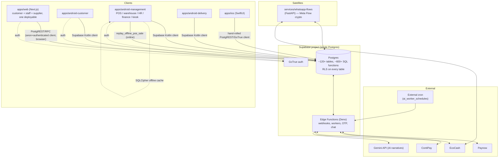

# Architecture Map — Nissan GTR Auto ERP (as-built, 2026-08-04)

> Read-only audit output. Produced per the "Cursor AI Master Audit Prompt" in
> `catalog/Nissan_GTR_Auto_Unified_ERP_Master_Design_Plan.md` (§11), run without code
> modification per §16.2. This is the **actual** architecture found in the repository —
> not the aspirational architecture described in planning docs. No product code was
> changed to produce this audit.

## 1. Repository shape

Polyglot pnpm monorepo (`pnpm@9.15.0`, Node ≥20), one Supabase/Postgres backend, five
client surfaces, one Python satellite service, one Python data pipeline.

```
apps/
  web/                  Next.js 15 App Router — customer + staff + supplier in ONE deployable
  android-customer/     Kotlin/Compose customer app (multi Gradle module)
  android-management/   Kotlin/Compose staff app — POS/warehouse/HR/finance/dispatch/kiosk
  android-delivery/     Kotlin/Compose driver-only app
  ios/                   Swift/SwiftUI customer app (SPM package `GTRCustomerCore` + app target)
packages/
  shared/               Cart/pricing/ledger/inventory/loyalty/warranty domain helpers (TS)
  supabase-client/      Typed Supabase client + generated `database.types.ts`
  ui/                    Cross-platform design tokens
  documents/             PDF/document generation helpers
bridges/
  ios/, android/         Native QR/printer/biometric/GPS bridges (Bridge-First)
supabase/
  migrations/           ~95 versioned SQL migrations, 2026-07-23 → 2026-08-03
  functions/             Deno edge functions (webhooks, workers, OTP, chat)
  tests/                 SQL smoke tests (RLS, exclusions)
data-pipeline/          Python — Nissan FAST parsing, PartSouq/Amayama scraping, diagram gen
services/whatsapp-flows/ Python FastAPI — Meta WhatsApp Flow crypto + EcoCash/Paynow callbacks
```

No `middleware.ts` exists anywhere in the repo (verified by direct search of `apps/web`).
No Hilt/Koin/Dagger dependency exists in either Android app (verified — see
`structural-critique.md` §4). CI (`\.github/workflows/ci.yml`) runs lint/typecheck/test,
a hard-exclusion grep (ZIMRA/payroll-tax/HTML5-QR), and a Dockerized migrate + RLS smoke
job — this is real and running, not aspirational.

## 2. Technology stack (verified)

| Layer | Stack | Evidence |
|---|---|---|
| Backend | Supabase (Postgres + PostgREST + GoTrue + Edge Functions/Deno) | `supabase/migrations/*.sql`, `supabase/functions/*/index.ts` |
| Web | Next.js App Router, TypeScript, CSS Modules | `apps/web/package.json`, `apps/web/next.config.ts` |
| Android (both apps) | Kotlin, Jetpack Compose, manual/factory DI (no Hilt/Koin found) | `apps/android-*/**/*.kt`, `build.gradle.kts` |
| Offline POS | SQLCipher (`net.sqlcipher`) + Android Keystore `EncryptedSharedPreferences` + WorkManager | `SqlCipherOfflinePosStore.kt`, `OfflinePosPassphrase.kt`, `OfflinePosSyncWorker.kt` |
| iOS | Swift/SwiftUI, SPM local package `GTRCustomerCore`, hand-rolled `PostgrestClient`/`GoTrueAuthClient` | `apps/ios/Sources/GTRCustomerCore/*.swift` |
| Data pipeline | Python (FAST EPC parsing, PartSouq scraping, FlareSolverr anti-bot, diagram asset generation) | `data-pipeline/data_pipeline/*.py` |
| Satellite | Python FastAPI (WhatsApp Flow crypto, EcoCash direct C2B) | `services/whatsapp-flows/app/*.py` |
| Payments | Paynow (SHA512 hash), ContiPay (HMAC-SHA256 + Basic Auth), EcoCash (direct C2B + webhook) | `supabase/functions/_shared/payment_edge.ts` |
| CI | GitHub Actions — lint/typecheck/test, exclusion grep, Docker Supabase + RLS smoke | `.github/workflows/ci.yml` |

## 3. Current architectural style

**Not** a modular monolith with defined bounded contexts. It is a **shared-database,
many-thin-clients** architecture:

- **One Postgres database is the single source of truth** for every domain (auth, catalog,
  inventory, procurement, POS, HR, finance, logistics, AI/CRM). There is no service boundary
  between domains — all business logic lives as **Postgres functions** (mostly
  `SECURITY DEFINER` PL/pgSQL), not in an application-tier service layer.
- **All five client surfaces talk directly to Postgres** via PostgREST/RPC using the
  Supabase JS/Kotlin/Swift clients — there is no intermediating API gateway, BFF, or
  workflow-orchestration layer (contrast with Medusa's workflows-SDK, see
  `domain-database-analysis.md` §5).
  - Verified for web: every `apps/web/lib/*.ts` file calls `createWebClient()` +
    `.rpc()`/`.from()` directly (`apps/web/lib/staff-pos.ts:3-13`, and 30 other `lib/*.ts`
    files, per the web architecture workstream).
  - Verified for Android: `RpcClient` implementations (`SupabaseRpcClient`) call the
    Supabase Kotlin client directly from `core/rpc`, and ViewModels call `RpcClient`
    directly with **no repository/use-case layer** (`PosViewModel.kt:120-126`).
- **Authorization is centralized in the database**, via `SECURITY DEFINER` functions that
  self-check caller role (e.g. `public._require_payments_staff()`,
  `public.has_staff_role(...)`) and Row Level Security policies. This is actually the
  *correct* pattern per the project's own non-negotiable rule ("treat backend
  authorization as authoritative") — see `security-findings.md` for where this holds and
  where client-side gates exist *without* a verified server equivalent.
- **No message queue / event bus.** Background work (AI reports, CRM promos, receipt
  delivery, SMS) is implemented as **outbox tables + Edge Function workers invoked by
  external cron** (`ai_worker_schedules`, `sms_outbox`, `customer_receipt_outbox`), not a
  durable queue. `docs/decisions/2026-08-03-ai-autonomous-layer-constraints.md` confirms
  this is deliberate ("Adopt-first on existing AI stack... do not introduce a parallel LLM
  microservice").
- **Offline is a client-side cache/outbox, not a second source of truth**: the tablet POS
  keeps a SQLCipher-encrypted local snapshot + pending-sale queue and replays through the
  same online RPC surface (`replay_offline_pos_sale`) with idempotency keyed on
  `client_sale_id` (`supabase/migrations/20260803270000_pos_offline_sync.sql:9-19,132-307`).
  This matches the project's own ADR (`docs/decisions/2026-08-03-offline-sqlcipher-pos-cache.md`).

## 4. Mermaid — current container/context diagram



## 5. Client application map

| Surface | Audiences served | Notes |
|---|---|---|
| `apps/web` | Customer storefront, staff back-office, supplier portal, B2B trade — **all in one Next.js deployable**, split only by App Router route groups (`(storefront)`, `(account)`, `(staff)`, `(supplier)`, `(b2b)`) and a client-side `StaffGate` | No middleware; no separate admin build. See `structural-critique.md` §3. |
| `apps/android-management` | Sales staff, warehouse, HR, finance, dispatch, tablet kiosk | 79 RPC name constants, ~102-method `RpcClient` (God interface); `PosViewModel.kt` is 1,550 lines / 51 state fields / 61 handlers (God ViewModel). |
| `apps/android-customer` | Retail/B2B customers | Smaller, more disciplined ViewModels (~150-190 LOC each) than management app; same architectural *style* (direct RPC calls, no repository layer) but much smaller scope per screen. |
| `apps/android-delivery` | Delivery drivers only | Not covered by this pass's deep-dive workstreams; out of scope per user's stated focus areas. |
| `apps/ios` | Customer (parity subset of android-customer) | Hand-rolled `PostgrestClient`/`GoTrueAuthClient` in `GTRCustomerCore` rather than the official Supabase Swift SDK — worth a follow-up licensing/maintenance check (not scored here; no deep-dive workstream was run on iOS). |

## 6. Data ownership (current, not target)

| Domain | Owning tables (examples) | Single-owner? |
|---|---|---|
| Identity/roles | `profiles`, `staff_roles` (`20260723100000_foundation_roles.sql`) | Yes |
| Customers | `customers` (`20260723230000_sales_pos.sql:12`) | Yes, but **not unified** with `suppliers` — see `domain-database-analysis.md` §2 |
| Suppliers | `suppliers` (`20260724050000_procurement.sql:9`) | Yes, but duplicate contact-field shape vs `customers` |
| Inventory ledger | `stock_entries` / `stock_entry_lines` (movement) + `stock_levels` (balance) (`20260723220000_inventory_ops.sql`) | Mostly — but `warehouse_bins`, `wishlist_back_in_stock_move_to_cart` also write `stock_levels` directly (3 migration files touch it outside the core movement path) |
| Finance ledger | `chart_of_accounts`, `journal_entries`, `journal_entry_lines` (`20260723100100_chart_of_accounts_ledger.sql`) | Yes — append-only pattern enforced in `packages/shared/src/ledger/journal.ts` (`assertBalanced`) |
| POS | `pos_carts`, `pos_cart_lines`, `sales_invoices`, `sales_invoice_lines`, plus **7 more POS-adjacent tables** added across 6 later migrations (`pos_action_audit`, `pos_quotations`, `pos_quotation_lines`, `pos_offline_sale_receipts`, `pos_scan_sessions`) | Fragmented across 9+ tables/migrations spanning 2026-07-23 → 2026-08-03 — see `structural-critique.md` §1 |
| AI/CRM/Stores | `ai_promo_settings/runs/deliveries`, `inventory_abc_snapshots`, `inventory_ai_directives`, `ai_worker_schedules` | New, bolted onto existing `customers`/`sales_invoice_lines`/`stock_items` via read-only aggregation functions — does not introduce a second source of truth (positive finding, see `domain-database-analysis.md` §4) |

## 7. What this document deliberately does not claim

Per the audit's non-negotiable rules, items not directly verified by reading code are
marked **UNKNOWN** rather than assumed:

- **iOS app architecture** — not deep-dived in this pass (no dedicated workstream was run
  against `apps/ios`); the file inventory above is structural, not a quality assessment.
- **`apps/android-delivery`** — out of scope for the deep-dive workstreams in this pass.
- **Production deployment topology** (hosting, CDN, backups, DR) — no infra-as-code found
  in-repo beyond `supabase/` migrations and `docker-compose.satellites.yml` references;
  UNKNOWN whether backups/DR run today. Evidence needed: hosting/ops runbook or Supabase
  project dashboard export.
- **Live dependency versions and CVEs** — `package.json` lists engines/scripts only; a
  full `pnpm audit` / Gradle dependency-vulnerability pass was not run in this workstream.
