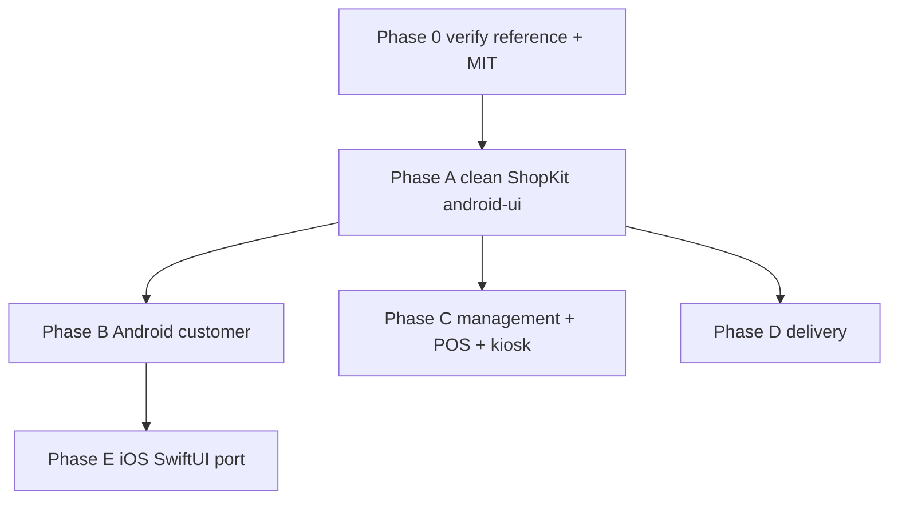

# ShopKit Clean-Slate Execution Plan

- Status: **MOBILE ADOPTION COMPLETE** (Phase 0 **DONE** · Phase A **FROZEN / DONE** — `/verifier` `5f5f66ef` + `/manager` freeze; `Shop*` API locked · Phase B **DONE — GATE CLOSED 2026-08-05** — coding `942f808c`, sec `fbd051e9` PASS, verifier `5ae1de37` PASS · Phase C **DONE — GATE CLOSED 2026-08-05** — coding `24919145`, sec `f994a42b` PASS, verifier `94f7474f` PASS · Phase D **DONE — GATE CLOSED 2026-08-05** — coding `bad5dbc4`, sec `ba3829ef` PASS, verifier `0bffb915` PASS · **Phase E DONE — GATE CLOSED 2026-08-05** — coding `56489540`, sec `a491c507` PASS, verifier `39ab0726` PASS WITH BUILD SKIP)
- Date: 2026-08-05
- **§1 compliance restore 2026-08-05:** ShopKit re-forked from `reference/shopping-by-kmp` into Phase A file layout; disposable `ShopKit*.kt` / `ShopShell.kt` scraps deleted.
- Phase E (iOS): **DONE — GATE CLOSED 2026-08-05** — coding `56489540` · `/security-reviewer` `a491c507` PASS (WARNs: JWT UserDefaults; no refresh; demo-track-token; bridge dup) · `/verifier` `39ab0726` PASS WITH BUILD SKIP (static green; `xcodebuild` unavailable Windows) · `/manager` gate CLOSED
- Lane(s): `/manager` sequences → Phase A `@android_agent` (owns `packages/android-ui`) → Phase B `@android_agent` → Phase C `@management_app_agent` → Phase D `@android_delivery_agent` + `@hardware_mobile_agent` → Phase E `@ios_agent`; `@backend_agent` only for missing RPC bindings; `@hardware_mobile_agent` for maps/GPS/signature/camera bridges
- Skills: `/token-discipline` (always); `/ui-ux-pro-max` explicit-invoke for design polish only; `/qr-inventory-workflow` if POS QR touched
- Parent plan (plan-of-record for scope/matrix): `docs/plans/2026-08-05-shopping-by-kmp-full-adoption-plan.md`
- OSS reference: [razaghimahdi/Shopping-By-KMP](https://github.com/razaghimahdi/Shopping-By-KMP) — **MIT** © 2023 Mahdi Razzaghi Ghaleh — at `reference/shopping-by-kmp/` (**gitignored; may be ABSENT locally**)

## 0. Prime directive (why this doc exists)

All Opus coding agents **START AFRESH with solid plans**. Existing partial ShopKit/scaffold mixes are treated as **DISPOSABLE**. The default action for any UI layer is **REWRITE from the KMP reference**, not patch of `Gtr*` / Jetsnack leftovers. Behavior-bearing subsystems (Supabase `RpcClient`, POS offline, kiosk, maps-nav, signature pad, address RPCs) are **preserved** where already correct.

**Non-negotiable (inherited):** every mobile UI surface (customer, management, delivery, iOS) is Shopping-By-KMP / ShopKit design-system based, GTR branded. No "chrome polish," no `GtrScaffold` look, no "ShopKit cards on old hub."

## 1. Clean-slate constraints (binding on every phase)

1. **Reference may be absent.** `reference/shopping-by-kmp/` is gitignored and may not exist locally. **Phase 0 must re-shallow-clone and verify MIT LICENSE before any UI copy.** No UI copy proceeds without the reference present and license confirmed.
2. **`packages/android-ui` ShopKit WIP is DISPOSABLE / REWRITE-default.** Keep a file only if it is *proven clean* (reviewed, compiles against clean-slate res, no legacy coupling). Two known compile blockers if kept as-is:
   - Missing fonts: `GtrTypography.kt` → `R.font.titillium_web_{regular,semibold,bold}`, `R.font.source_sans_3_{regular,semibold,bold}` (no `res/font/`).
   - Missing drawable: `GtrChrome.kt` → `R.drawable.gtr_logo` (no `res/drawable/`).
   - **Resolution (Phase A step 1):** add real `res/font/` OFL faces + `gtr_logo` vector **OR** temporarily fall back to system fonts + a vector placeholder logo so the module compiles; do not leave dangling `R.*` references.
3. **~29 screens still call legacy `Gtr*`.** Strategy is **deprecate-after-rewrite**: build clean ShopKit first, migrate screens phase-by-phase, then remove `Gtr*`. **Do NOT mass-delete `Gtr*` on day one** (would break every app at once).
4. **`NOTICE` exists; `packages/android-ui/README.md` is missing.** Phase A adds the module README (MIT attribution + ShopKit usage contract).
5. **iOS address gap.** `StorefrontApi.swift` declares `listOwnAddresses` / `upsertCustomerAddress` / `deleteCustomerAddress` but `LiveStorefrontApi.swift` has **no implementations** (Fake has partial). Phase E must wire these against `upsert_customer_address` / `delete_customer_address`.
6. **Preserve behavior elsewhere:** `bridges/android/maps-nav`, POD signature pad, POS offline/kiosk (SQLCipher, Lock Task, Device Admin), and customer address RPCs — **keep as-is if already correct**; only re-skin their UI into ShopKit.

## 2. Exclusions (hard stops — inherited)

No ZIMRA/FDMS/fiscalisation · no payroll tax · Bridge-First only (no HTML5/WebView QR/camera/GPS/printer) · no dual SoR (Ktor/Laravel/Odoo/ERPNext) · no OmniCart/GSF code · RLS on every new table · multi-currency explicit · ledger append-only.

## 3. Order of execution (strict)

**A → then B / C / D in parallel → then E.** Phase A is the shared dependency: B, C, D all consume the clean ShopKit. No B/C/D screen work starts until Phase A's ShopKit compiles clean and its API is frozen. E (iOS) follows once ≥1 Android surface (Phase B) has stabilized the IA it must mirror.

---

## Phase 0 — Foundation gate (`/manager` + `@android_agent`)

**Status: DONE 2026-08-05**

- [x] `reference/shopping-by-kmp/` present (shallow clone); **MIT LICENSE** verified (© 2023 Mahdi Razzaghi Ghaleh / rq_mehdi).
- [x] `NOTICE` MIT attribution intact.
- [x] Maps keys remain `local.properties` / xcconfig only (no change this phase).
- [x] GTR brand tokens frozen: steel `#12151C`, chalk `#F4F5F7`, CTA `#C8102E`, Titillium + Source Sans 3.
- **Gate passed** → Phase A.

---

## Phase A — Clean ShopKit in `packages/android-ui` (FROM KMP only) — `@android_agent`

**Status: FROZEN / DONE 2026-08-05.** ShopKit `Shop*` API is **LOCKED** — B/C/D/E consume it as-is; changes require a new manager gate. Real fork from KMP `presentation/component/*`, `MainNav.kt`, `SplashScreen.kt`, `theme/*` into Phase A file layout. Public `Shop*` API documented in `packages/android-ui/README.md`.

**`/manager` verification 2026-08-05 (fork is REAL, not rename-reskin):**
- ✅ `reference/shopping-by-kmp/` present with MIT `LICENSE`; `NOTICE` intact; `packages/ui/fonts/ATTRIBUTION.md` + OFL texts present.
- ✅ `res/font/` (6 OFL faces) + `res/drawable/gtr_logo.png` present → `R.font.*` / `R.drawable.gtr_logo` resolve (earlier "missing font/logo" evidence in parent plan is STALE/resolved).
- ✅ Genuine KMP structure: `ShopScaffold` (KMP `DefaultScreenUI` — circle toolbar + chalk body), `ShopNavChrome` (KMP `MainNav BottomNavigationUI` — elevated Card, 16dp corners), `ShopKitStaff` (KMP `DefaultScreenUI`-shaped staff shell, replaces Jetsnack/`GtrBrandBar`). MIT headers on each.
- ✅ `Gtr*` = thin `@Deprecated` aliases → `Shop*` (`GtrScaffold` = `DeprecationLevel.ERROR`). README file-table matches actual files.

**FREEZE GATE — CLOSED (`/verifier` `5f5f66ef-8d79-447e-96af-a5700facdd76`, 2026-08-05):**
1. ✅ **Compile-green** — `:android-ui:compileDebugKotlin` BUILD SUCCESSFUL (exit 0) from `apps/android-customer`.
2. ✅ **Preview harness (A.4)** — `src/debug/.../shop/ShopKitPreviews.kt`, **7** realistic `@Preview`s (home rails, PDP, cart, list/order, splash, bottom nav, DefaultScreen) — not empty placeholders.
3. ✅ Hard-exclusion grep clean; no secrets; lane OK.

**`/manager` freeze granted 2026-08-05.** Phase A ShopKit is the locked foundation. **Phase B unblocked next**; C/D/E held (one lane at a time).

**Goal:** a self-contained, compiling ShopKit design system forked from KMP `presentation/ui/*` + theme, GTR-branded. No dependency on any app; no legacy `Gtr*` coupling.

### A.1 Resolve compile blockers first
- [x] `res/font/` — six OFL faces (`titillium_web_*`, `source_sans_3_*`).
- [x] `res/drawable/gtr_logo.png` present (matches web brand logo).
- [x] OFL attribution in `packages/ui/fonts/ATTRIBUTION.md`.

### A.2 Files to CREATE (clean-slate ShopKit)
Theme (rewrite from KMP theme, GTR tokens — keep only if proven clean):
- `.../ui/theme/GtrColors.kt` — steel/chalk/CTA + semantic tokens (verify, keep if clean)
- `.../ui/theme/GtrTypography.kt` — fix `R.font.*` per A.1
- `.../ui/theme/GtrShapes.kt`, `.../ui/theme/GtrTheme.kt` — `MaterialTheme` + `LocalGtrExtras` (spacing/section gaps)
- `.../ui/theme/GtrChrome.kt` — fix `R.drawable.gtr_logo` per A.1 (branded splash/logo host)

ShopKit primitives (fork from KMP `component/`, `home`, `detail`, `cart`, `splash`):
- `.../ui/shop/ShopTheme.kt` — entry `@Composable` wrapping `GtrTheme` (new)
- `.../ui/shop/ShopScaffold.kt` — `ShopDefaultScreen` + `ShopTabBody` + `ShopTopBar` (from KMP `DefaultScreenUI`)
- `.../ui/shop/ShopNavChrome.kt` — bottom-tab bar + nav host chrome (from KMP `MainNav`)
- `.../ui/shop/ShopCards.kt` — `ShopProductCard` (KMP `ProductBox`), `ShopListCard`, `ShopStatusChip`, `ShopCircleBadge`
- `.../ui/shop/ShopLists.kt` — rails / grids / section headers (KMP home rails)
- `.../ui/shop/ShopPdp.kt` — PDP primitives: gallery, rating row, expandable description, `ShopStickyCtaBar`, fitment/core-charge slots
- `.../ui/shop/ShopControls.kt` — `ShopSearchBar`, `ShopLocationRow`, buttons, `ShopStepProgress`, `ShopAddressPicker`
- `.../ui/shop/ShopSplash.kt` — branded splash (from KMP `SplashScreen`)
- `packages/android-ui/README.md` — **NEW** (constraint #4): MIT attribution, ShopKit API contract, "do not reintroduce `Gtr*` scaffolds" note

> Existing WIP files (`ShopKit.kt`, `ShopKitScaffold.kt`, `ShopKitStaff.kt`, `ShopShell.kt`, `ShopKitShell.kt`) are the **disposable scraps**. Reorganize their still-good primitives into the files above **only after per-symbol clean review**; default is rewrite from KMP, not lift-and-shift. Do not ship `ShopShell`/`ShopKitScaffold` scraps unless a symbol is proven clean. **Public Shop* symbol names are held stable across any file reorg so the ~29 consumer screens keep compiling until they are migrated phase-by-phase.**

### A.3 Legacy `Gtr*` APIs to DEPRECATE (annotate now, remove in later phases)
- `GtrScaffold` / `GtrFeatureBody` / `GtrScreen` / `GtrBrandBar` / `GtrSectionLabel` / legacy `GtrChrome` top-bar hosts used purely as screen shell → mark `@Deprecated("Use ShopDefaultScreen/ShopTabBody/ShopStaffScreen")`. **Keep compiling** until the ~29 consumer screens migrate (Phases B–D). Removal is a Phase-D-end cleanup task, not day one.

### A.4 Phase A acceptance (zero thin UX) — freeze checklist
- [x] KMP-forked ShopKit file layout + README + MIT (`NOTICE`) — manager-accepted as real fork.
- [x] `@Preview` harness (debug): `packages/android-ui/src/debug/java/co/zw/nissangtr/ui/shop/ShopKitPreviews.kt` — home rails, PDP, cart+proceed, list/order cards, splash, bottom nav, DefaultScreenUI (realistic OEM sample data; no empty shells).
- [x] Lane compile check 2026-08-05: `./gradlew :android-ui:compileDebugKotlin` **BUILD SUCCESSFUL** (includes debug previews; fonts/`gtr_logo` R.* resolve).
- [x] **`/verifier` formal sign-off** `5f5f66ef-8d79-447e-96af-a5700facdd76` — compile-green + 7-preview harness + exclusions clean.
- [x] **`/manager` freeze granted 2026-08-05** — Phase A FROZEN/DONE; `Shop*` API locked; B/C/D/E consume as-is.

---

## Phase B — Android customer (`@android_agent` + `@hardware_mobile_agent` for maps)

**Status: DONE — GATE CLOSED 2026-08-05.** Coding `942f808c` (genuine `Shop*` shell/screens, not RENAME_ONLY) → `/security-reviewer` `fbd051e9` **PASS** (no blockers; WARN `allowBackup=true`) → `/verifier` `5ae1de37` **PASS** (`assembleDebug` green; zero `Gtr*` scaffolds; exclusions clean; ShopKit shell verified). `/manager` gate CLOSED. **Phase C unblocked next; D/E HELD.**

> **Open WARNs (deferred, non-blocking):** (1) `android:allowBackup=true` — revisit before release. (2) `packages/android-ui` fully untracked → Phase A freeze is **process-only until committed** (recommend committing the frozen module; **not** committed — user has not asked). (3) unit tests not run this gate.

Full REWRITE of customer UI on clean ShopKit; wire every KMP customer feature to existing `RpcClient` (no new SoR).

- [x] **Full-screen map:** `feature/address` + `AddressPickMap` (`bridges/android/maps-nav`); key from `local.properties` / `BuildConfig.GOOGLE_MAPS_API_KEY`.
- [x] **4-tab shell:** Home / Wishlist / Cart / Profile via `ShopBottomBar` + `ShopBottomTab` under `ShopTheme` in `MainActivity.kt`.
- [x] Wire KMP features to `RpcClient` (splash/auth, home rails, PDP, search, wishlist, cart/checkout, address, orders, reviews, profile extras).
- [x] Migrate all customer screens off `GtrScaffold`/`GtrScreen`/`GtrBrandBar`/`GtrFeatureBody`/`GtrTheme` (zero scaffold hits in `apps/android-customer`; `GtrColors` token use OK).
- [x] **Acceptance:** `./gradlew :app:assembleDebug` green; honest empties (deals/coupons/wallet/notifications); ContiPay/Paynow/EcoCash only; fitment vs garage + core-charge parent/child split (fake ATC); sticky ATC; search filter/sort.

---

## Phase C — Management + POS + kiosk (`@management_app_agent`)

**Status: DONE — GATE CLOSED 2026-08-05.** Coding `24919145` (genuine `Shop*` shell/screens) → `/security-reviewer` `f994a42b` **PASS** → `/verifier` `94f7474f` **PASS**. `/manager` gate CLOSED. **Phase D unblocked next; E HELD.**

> **Open WARNs (deferred, non-blocking):** (1) offline PII retention — revisit before release. (2) `module_access` fail-open when empty — revisit role-gating hardening. Do not block Phase D.

ShopKit UI rewrite of hub + POS + staff modules; **preserve behavior**.

**Preserve-behavior checklist (UI re-skin only, do not gut):**
- [x] POS two-pane: catalog-left / cart-right layout intact (`PosWorkspace` / `TWO_PANE_MIN_WIDTH`)
- [x] Offline SQLCipher queue + `replay_offline_pos_sale` idempotency (untouched; `SqlCipherOfflinePosStore` / sync engine still wired)
- [x] Kiosk Lock Task + Device Admin receiver + boot receiver (untouched; Device Admin console on ShopKit panels)
- [x] Role-based routing / `module_access` (`ManagementHomeRoles` + hub `StaffModuleTile` gating intact)
- [x] `PosCartLineOps` / offline store behavior (untouched; no PosViewModel split)
- [x] QR via Bridge-First only (still `QrScannerBridge` / CameraX — no HTML5)

**Coding deltas (2026-08-05):**
- Hub: `ShopStaffScreen` + `StaffModuleTile`; removed orphan `ManagementHubUi.kt` (profile-style rename) + `BrandedFeature` double-chrome; `ShopTheme` without `compact=true`.
- POS: `ShopStaffScreen` + `ShopStaffPanel` panes; `ShopProductCard` catalog grid; cart lines `ShopListCard`; quotes `ShopOrderBox`; two-pane preserved.
- Staff modules (warehouse/bins/consignment/dispatch/credit/fleet/HR clock+onboarding/chat/blankets) + Device Admin + SignIn on ShopKit scaffold/panels/buttons/lists.
- Zero `GtrScaffold`/`GtrScreen`/`GtrBrandBar`/`GtrFeatureBody` / zero `ShopStaffContent` leftover shells in `apps/android-management`.
- `./gradlew :app:assembleDebug` **BUILD SUCCESSFUL** (phoneDebug).

**Acceptance (formal gate CLOSED):**
- [x] Full ShopKit visual system across hub + POS + staff modules (not cards-on-old-hub)
- [x] Zero `Gtr*` scaffolds in `apps/android-management`
- [x] Preserve-behavior boxes verified by coding lane (behavior not gutted)
- [x] `/security-reviewer` PASS — `f994a42b`
- [x] `/verifier` PASS — `94f7474f`

- Split `PosViewModel` only if a till-touch requires it — **not done** (no speculative refactor).
- **Next:** Phase D (`@android_delivery_agent`) — one lane; E remains HELD.

---

## Phase D — Delivery (`@android_delivery_agent` + `@hardware_mobile_agent`) — **DONE — GATE CLOSED 2026-08-05**

**Status: DONE — GATE CLOSED 2026-08-05.** Coding `bad5dbc4` (genuine ShopKit rebuild, not staff/`compact=true` reskin) → `/security-reviewer` `ba3829ef` **PASS** → `/verifier` `0bffb915` **PASS**. `/manager` gate CLOSED. **Phase E unblocked next** (one lane only).

> **Open WARNs (deferred, non-blocking):** (1) `android:allowBackup=true` + plaintext offline queues — revisit before release. (2) `CALL_PHONE` permission unused. (3) Fake-path test skip. Do not block Phase E.

ShopKit UI rewrite of jobs/POD; **maps-nav + signature behavior preserved**.

**Preserve-behavior checklist:**
- [x] `bridges/android/maps-nav` Directions polyline + multi-stop markers + turn-by-turn intent
- [x] GPS FGS ingest (`ingest_delivery_location`) unchanged
- [x] Touch signature pad (`PodSignatureCaptureActivity` / inline Canvas) → PNG → Storage → `submit_delivery_pod`
- [x] Presence, OTP verify, geofence, fail, panic, optimize RPCs

**Coding deltas (2026-08-05 — genuine ShopKit, not staff compact):**
- `MainActivity.kt` — `ShopTheme {}` **Standard density** (removed `compact=true`); `ShopSplash` → AuthGate → Jobs/Route/Me via `ShopBottomBar` (KMP MainNav IA).
- `JobsScreen.kt` — MyOrders-style Active/Done/Failed tabs + `ShopOrderBox`; Route/Me on `ShopTabBody` / Profile rows; stop detail on `ShopDefaultScreen` + `ShopProceedButtonBox` turn-by-turn; **zero** `ShopStaff*` usage.
- `PodScreen.kt` — POD steps on ShopKit section chrome (`ShopStepProgress` / bordered signature pad); inline Canvas + full-screen signature bridge unchanged.
- `SignInScreen.kt` — `ShopDefaultScreen` only (no staff shell).
- Zero `GtrScaffold` / `GtrScreen` / `GtrBrandBar` / `GtrFeatureBody` in `apps/android-delivery` (`GtrColors` tokens OK).
- `./gradlew :app:assembleDebug` **BUILD SUCCESSFUL**.

**Acceptance (formal gate CLOSED):**
- [x] Full ShopKit visual system (Standard density; no `compact=true`; no staff-shell shortcut)
- [x] Zero `Gtr*` scaffolds in `apps/android-delivery`
- [x] Maps + signature behavior preserved (bridges untouched; UI hosts only)
- [x] `/security-reviewer` PASS — `ba3829ef` (WARNs noted above; non-blocking)
- [x] `/verifier` PASS — `0bffb915`

**Post-D note (not Phase E):** End-of-D `Gtr*` alias removal from frozen `packages/android-ui` remains a **separate** `@android_agent` / manager task after B/C/D all gated — **do not** couple into Phase E; android-ui stays **FROZEN**.

---

## Phase E — iOS SwiftUI port (`@ios_agent` + `@hardware_mobile_agent`) — **DONE — GATE CLOSED 2026-08-05**

**Status: DONE — GATE CLOSED 2026-08-05.** Coding `56489540` (genuine ShopKit SwiftUI, not PARTIAL/RENAME) → `/security-reviewer` `a491c507` **PASS** (no blockers; WARNs: JWT in UserDefaults; no refresh; demo-track-token; bridge dup) → `/verifier` `39ab0726` **PASS WITH BUILD SKIP** (static green; `xcodebuild` unavailable on Windows host). `/manager` gate CLOSED. **Mobile clean-slate phases A–E complete.** Parent plan Phase 4 = this work.

**Prior DONE revoked then re-gated:** first pass was PARTIAL/RENAME; genuine KMP circle chrome + 4-tab + address Fake/Live re-done and signed off.

SwiftUI port matching Phase B Android customer IA (same ShopKit design language from Phase A, GTR branded). **`packages/android-ui` stays FROZEN** — iOS ports patterns in SwiftUI under `apps/ios`, does not edit the Android module.

### E acceptance checklist
- [x] **4-tab shell:** Home / Wishlist / Cart / Profile in `ContentView` — **not** thin 3-tab Shop/Cart/Account.
- [x] ShopKit SwiftUI primitives forked from Phase A design language (not rename-only `ShopKit.swift` scraps).
- [x] Home rails + automotive PDP (fitment, core charge, wishlist heart, sticky ATC) in `CatalogScreen`.
- [x] Cart + checkout with dispatch **address step** + USD/ZiG; pay via Profile → ContiPay / Paynow / EcoCash only.
- [x] Profile hub keeps GTR extras: garage / compare / chat / track / reviews (+ orders, pay, addresses).
- [x] **Wire iOS address gap (constraint #5):** `listOwnAddresses` / `upsertCustomerAddress` / `deleteCustomerAddress` in Fake + `LiveStorefrontApi` against `upsert_customer_address` / `delete_customer_address`; MapKit pick in `AddressScreen` (lat/lng via `AddressGeo` in line2).
- [x] `LiveStorefrontApi` remains SoR; ReviewCamera bridge unchanged (Bridge-First).
- [x] Honest empties for coupons / notifications / wallet (no fake timers).
- [x] `/security-reviewer` PASS — `a491c507`
- [x] `/verifier` PASS WITH BUILD SKIP — `39ab0726` (macOS `xcodebuild` confirm deferred)
- **Acceptance:** iOS IA parity with Phase A+B ShopKit; address list/upsert/delete + map pick wired Fake+Live; GTR PSPs; no thin UX / rename-only pass.

**Coding deltas (2026-08-05 — genuine ShopKit, not steel-bar reskin):**
- `Theme/ShopKit.swift` — KMP circle `ShopTopBar` / `ShopDefaultScreen` / `ShopTabBody` / `ShopSplash` / bordered circle buttons / ProductBox cards / sticky PDP+cart CTAs (no `GTRBrandBar` in shell).
- Feature screens migrated off steel `GTRBrandBar` → `ShopDefaultScreen` (Orders, Pay, SignIn, Garage, Compare, Chat, Reviews, DeliveryTrack, Address, Catalog search).
- `GTRCustomerApp` — `ShopSplash` → 4-tab `ContentView` under `shopTheme()`.
- Address Fake+Live + MapKit pick unchanged (already wired).
- **Build:** Windows host has no `xcodebuild` — verify on macOS: `cd apps/ios && xcodebuild -scheme GTRCustomer -destination 'platform=iOS Simulator,name=iPhone 16' build`.
- Zero `GTRBrandBar` call sites under `GTRCustomer/Features/**`.

### E paths (re-do — genuine visual parity, not rename-reskin)
- `apps/ios/Sources/GTRCustomerCore/{StorefrontApi,LiveStorefrontApi}.swift` — address methods
- `apps/ios/GTRCustomer/Theme/ShopKit.swift` — SwiftUI ShopKit port of Phase A design language
- `apps/ios/GTRCustomer/Features/AddressScreen.swift` — MapKit pick
- `apps/ios/GTRCustomer/{ContentView,Features/{Catalog,Cart,Wishlist,AccountHub}Screen}.swift`
- `apps/ios/GTRCustomer.xcodeproj/project.pbxproj`, `Info.plist` (location when-in-use for optional map center)
- **Not in lane:** `packages/android-ui/**` (FROZEN)

---

## Agent assignments

| Phase | Lane |
|---|---|
| 0 gate | `/manager` + `@android_agent` |
| A ShopKit | `@android_agent` (owns `packages/android-ui`) |
| B customer | `@android_agent` + `@hardware_mobile_agent` (maps) + `@backend_agent` (RPC bindings only) |
| C management/POS/kiosk | `@management_app_agent` |
| D delivery | `@android_delivery_agent` + `@hardware_mobile_agent` |
| E iOS | `@ios_agent` + `@hardware_mobile_agent` |
| Security | `/security-reviewer` (auth, address, pay, Maps keys, POD upload) |
| Tests/exclusions | `/verifier` after each phase |

## Global acceptance criteria (zero thin UX)

1. Phase A ShopKit compiles standalone; no dangling `R.*`; README + MIT present.
2. No screen ships as `GtrScaffold`/Jetsnack/"chrome polish"/"cards on old hub."
3. All four surfaces (customer, management, delivery, iOS) are ShopKit design-system based, GTR branded.
4. Behavior preserved: POS offline/kiosk, maps-nav, POD signature, address RPCs — verified, not regressed.
5. Payments = ContiPay/Paynow/EcoCash only; no PayPal/Apple/Google Pay stubs; no fake coupons/timers.
6. iOS Live + Fake address methods implemented — **Phase E DONE — GATE CLOSED** (coding `56489540`, sec `a491c507`, verifier `39ab0726`).
7. `Gtr*` deprecated after rewrite; end-of-D alias removal from frozen `packages/android-ui` remains **deferred follow-up** (not a new phase).
8. `/verifier` hard-exclusion grep clean; no secrets committed.

## Paths in scope

- `packages/android-ui/**` (Phase A — theme, `shop/`, `res/font`, `res/drawable`, README)
- `apps/android-customer/**` (Phase B) · `apps/android-management/**` (Phase C) · `apps/android-delivery/**` (Phase D)
- `apps/ios/Sources/GTRCustomerCore/{LiveStorefrontApi,StorefrontApi,StorefrontModels}.swift` (Phase E)
- `bridges/android/**` (maps-nav, pod-signature, GPS, pod-camera — preserve)
- `NOTICE`, `packages/ui/BRAND_TOKENS.md`, `packages/ui/fonts/ATTRIBUTION.md`
- **Not:** Ktor sample, Laravel admin, OmniCart, GSF; KMP `webApp` runtime; new SoR

## Out of scope

- Continuing from any partial `ShopKitScaffold`/`ShopShell` scrap unless a symbol is proven clean (default = rewrite).
- CMP shared UI, TV/Automotive/Desktop targets, dark mode, Koin, full i18n (Phase N, new approval).
- B2B procurement inside customer shell; staff ERP redesign beyond ShopKit re-skin.
- Web (`apps/web`) — tracked separately under parent plan §14.

## Risks / exclusions

| Risk | Mitigation |
|---|---|
| Reference absent locally | Phase 0 gate: re-clone + MIT verify before any copy |
| Font/logo compile blockers | Phase A.1 real OFL faces + vector logo, or temporary system-font/placeholder fallback |
| Mass `Gtr*` delete breaks all apps | Deprecate-after-rewrite; removal only at end of Phase D |
| iOS Live address unimplemented | Phase E explicit wire task (constraint #5) |
| Maps/POS/kiosk/signature regressions | Preserve-behavior checklists + `/verifier` per phase |
| Maps key leakage | keys only in `local.properties`/xcconfig; `/security-reviewer` |

## Handoff (historical — mobile A–E complete)

1. `/manager` ran Phase 0 gate, then sequenced Phase A (`@android_agent`).
2. After A froze ShopKit: Phase B → C → D → E (one lane at a time).
3. `/security-reviewer` + `/verifier` per phase; `/manager` done gate per phase.
4. **Phase E GATE CLOSED 2026-08-05** — mobile clean-slate execution complete.

### Deferred follow-ups (NOT new phases — no manager sequence unless user opens them)

| Follow-up | Owner | Notes |
|---|---|---|
| macOS `xcodebuild` confirm | `@ios_agent` / host | Verifier `39ab0726` skipped build on Windows; run `cd apps/ios && xcodebuild -scheme GTRCustomer -destination 'platform=iOS Simulator,name=iPhone 16' build` |
| Commit frozen `packages/android-ui` | user / commit gate | Shop* API locked; commit when user requests |
| `android:allowBackup=true` + plaintext offline queues | `@android_agent` / `@management_app_agent` / `@android_delivery_agent` | Sec WARNs B/D — revisit before release |
| Offline PII retention; `module_access` fail-open when empty | `@management_app_agent` | Phase C sec WARNs |
| JWT in UserDefaults; no refresh; demo-track-token; bridge dup | `@ios_agent` | Phase E sec WARNs — Keychain / refresh / token cleanup |
| `Gtr*` alias removal from frozen android-ui | `@android_agent` | Post-D note; only after all consumers migrated |
| Customer IA fine-tune (5-tab + top strip + hamburger) | `@android_agent` + `@ios_agent` | **DONE 2026-08-05** — Home/Shop/Wishlist/My Garage/Settings; Cart+Account+Sign-in top bar; Car Parts → categories → subcategories menu; GTR brand only (no GSF assets). Android `:app:assembleDebug` required; iOS static parity (xcodebuild Windows N/A). |
| `CALL_PHONE` unused; fake-path test skip | `@android_delivery_agent` | Phase D WARNs |
| Web ← KMP (§14 / Phase 1w) | `@web_agent` | Parent plan — **out of clean-slate mobile scope** |

**Next invoke:** none for clean-slate mobile. Open deferred follow-ups only on user request (one lane).
