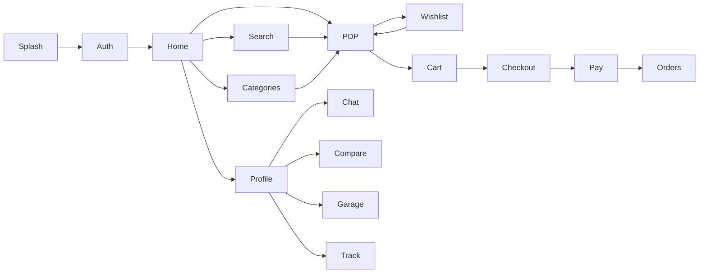
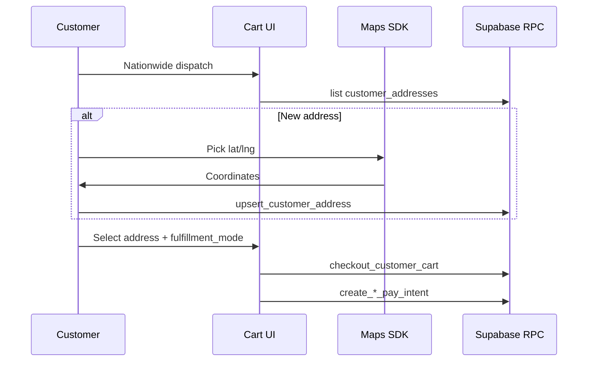
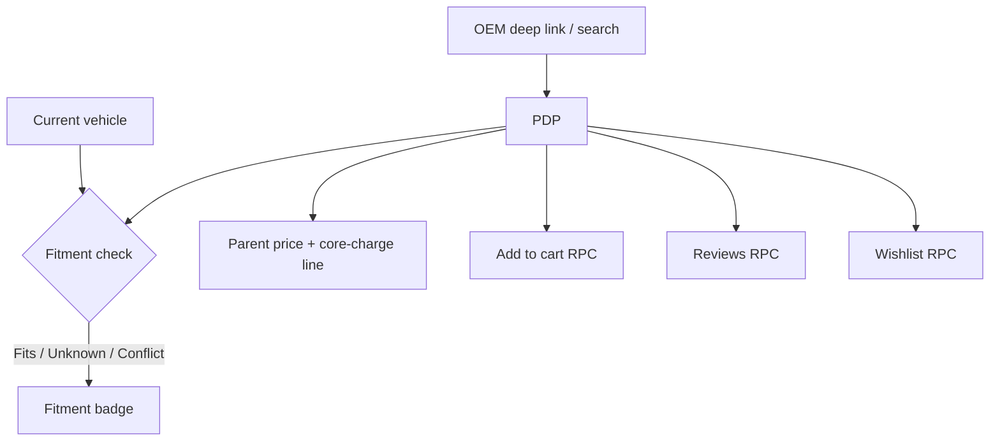
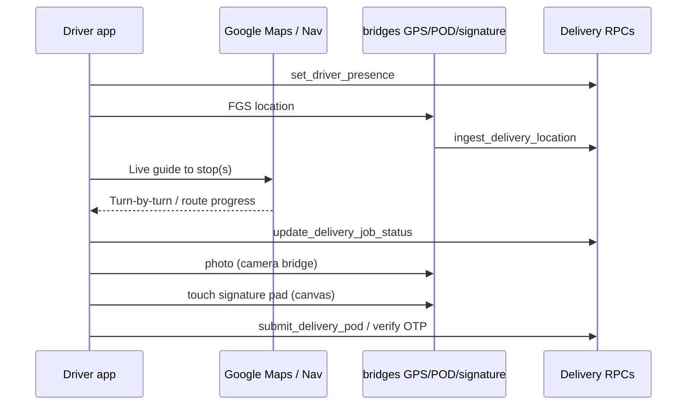
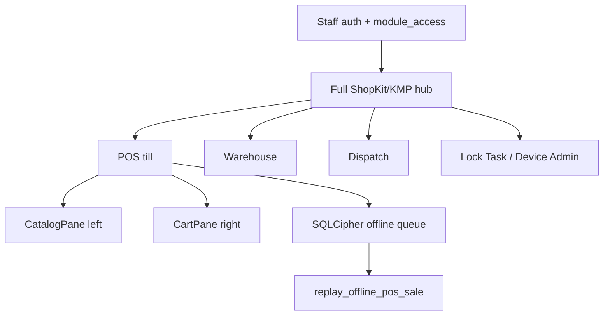
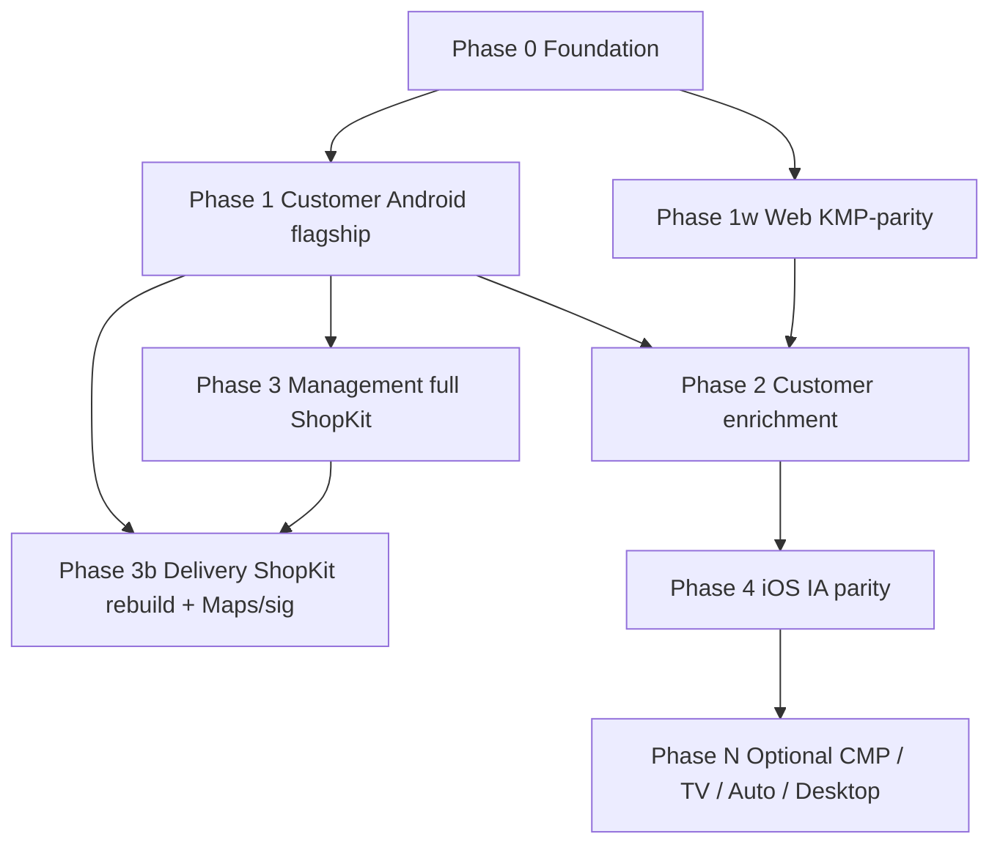

# Shopping-By-KMP Full Adoption Plan

> **Supersede / approval note (2026-08-05):** User replied **Approve with changes**. This document is the plan-of-record. Prior “awaiting approval / STOP — no product implementation” gate is **lifted for approved scope below**. Pre-approval WIP (§1.1) may proceed under `/manager` sequencing; amend or roll back only if a phase find proves it wrong. Short discovery plan `docs/plans/2026-08-05-shopping-by-kmp-adoption.md` remains superseded.

- **Status:** **Approved with changes** (2026-08-05) — **mobile clean-slate A–E COMPLETE** (execution child plan gates CLOSED); coding lanes may implement remaining approved scope (§14 web / deferred follow-ups only on user request)
- **Date:** 2026-08-05
- **Lane(s):** `/manager` sequences; Phase 1 `@android_agent` (flagship); **Phase 1w `@web_agent`** (Web ← KMP feature bridge, parallel-capable after Phase 0); Phase 3 `@management_app_agent`; **Phase 3b `@android_delivery_agent` + `@hardware_mobile_agent`** (live Maps nav + POD signature pad — **must**, not Later); Phase 4 `@ios_agent`; `@backend_agent` only for missing RPC client bindings; Maps/camera/GPS/signature via `@hardware_mobile_agent`
- **Skills:** `/token-discipline` (always); `/ui-ux-pro-max` only if explicitly invoked; `/qr-inventory-workflow` if POS QR touch
- **OSS:** [razaghimahdi/Shopping-By-KMP](https://github.com/razaghimahdi/Shopping-By-KMP) @ `reference/shopping-by-kmp/` (gitignored)
- **License:** **MIT** — Copyright (c) 2023 Mahdi Razzaghi Ghaleh (`rq_mehdi`)
- **Supersedes (as plan-of-record):** shallow Jetsnack-only redesign; short `docs/plans/2026-08-05-shopping-by-kmp-adoption.md`
- **Sources merged:** KMP inventory (agent `2d917f19`); GTR backend/web inventory (agent `c2115fa9`); GitHub tree + README; `RpcNames` / `StorefrontApi` / web routes; audits; GSF UX ADR (IA only); OmniCart rejected (no LICENSE)
- **Approval deltas (this revision):** (1) Web adopt/adapt KMP ecommerce UX into `apps/web` — new **§14 Web ← KMP feature bridge**; (2) Delivery **must** ship live Google Maps guidance to stop(s) + touch signature pad POD; (3) Roadmap elevates Web KMP-parity + Delivery Maps/signature; customer Android stays Phase 1 flagship; management/delivery get **full ShopKit/KMP visual system** while preserving POS/kiosk/offline/maps/signature behavior
- **User correction (2026-08-05):** **Non-negotiable** — every mobile app UI (customer, management, delivery, iOS) is **Shopping-By-KMP design-system based (ShopKit), GTR branded**. Not “chrome polish,” not leftover Jetsnack/`GtrScaffold`. Delivery Maps/signature landed on old style → **rebuild delivery UI from KMP design** (in progress); management likewise full visual system, not “ShopKit cards on old hub.”


## 1. Executive summary

**Goal:** Adopt Shopping-By-KMP’s MIT Compose Multiplatform shopping UX as the **non-negotiable visual design system (ShopKit, GTR branded)** for **all** mobile apps — customer Android, management, delivery, and iOS — **bridge the same ecommerce patterns into `apps/web`** (Adopt / Adopt-adapt — do not discard KMP patterns for web), and deliver **live Maps turn-by-turn guidance + in-app touch signature POD** on the driver app — while **keeping Supabase RpcClient / LiveStorefrontApi / web SoR**, never dual-stack. Staff/driver **behavior** (POS two-pane, offline, kiosk, GPS FGS, Maps, signature) stays; **discarded scaffolds** (Jetsnack theme, legacy `GtrScaffold` look) do not.

**Non-negotiable (2026-08-05):** Every mobile UI surface is Shopping-By-KMP / ShopKit design-system based and GTR branded. “Chrome polish,” Compact-shell-only, or ShopKit-cards-on-old-hub are **out**.

**Why not Jetsnack-only:** User rejected a shallow theme rebuild. KMP supplies a complete commerce screen graph under MIT — that design language applies to **all** apps, not customer-only.

**Approval state:** **Approved with changes** (2026-08-05). Stop-coding gate lifted for scope in this doc.


### 1.1 Pre-approval WIP (provisional → may ship under Phase 0–1)

| Artifact             | Path                                                | Note                                        |
| -------------------- | --------------------------------------------------- | ------------------------------------------- |
| MIT NOTICE           | `NOTICE`                                            | Keep under MIT attribution                  |
| ShopKit fork         | `packages/android-ui/.../shop/ShopKit.kt`           | Complete vs §4 matrix in Phase 1            |
| 4-tab shell          | `apps/android-customer/.../MainActivity.kt`         | Home / Wishlist / Cart / Profile            |
| Short discovery plan | `docs/plans/2026-08-05-shopping-by-kmp-adoption.md` | **Superseded**                              |


## 2. License & adopt-first decision


| Option                                                             | Verdict             | Reason                                                                                                                 |
| ------------------------------------------------------------------ | ------------------- | ---------------------------------------------------------------------------------------------------------------------- |
| **Integrate** as Gradle submodule / library dep                    | **Reject**          | Full demo app + own Ktor/fake stack; not a reusable library                                                            |
| **Fork** presentation into GTR tree                                | **Choose**          | MIT allows copy/modify; ShopKit + feature screens; rebrand to GTR tokens                                               |
| **Integrate** data/backend from KMP                                | **Reject**          | Dual SoR forbidden                                                                                                     |
| **Full CMP shared UI** (`packages/kmp-storefront`) for Android+iOS | **Defer** (Phase N) | Needs CMP+iOS toolchain; iOS already SwiftUI + `LiveStorefrontApi`                                                     |
| **Web ← KMP UX patterns** (Next.js, not KMP JS)                    | **Choose**          | New workstream §14 — Adopt / Adopt-adapt KMP ecommerce UX into `apps/web`; **do not** ship KMP `webApp`                |
| OmniCart code                                                      | **Reject**          | No LICENSE                                                                                                             |
| GSF APK code/assets                                                | **Reject**          | Proprietary WebView; IA notes only                                                                                     |
| Ktor sample / Laravel admin                                        | **Reject as SoR**   | Map capabilities to Supabase                                                                                           |


**Attribution:** keep `NOTICE`; Maps keys only in `local.properties` / xcconfig.

**Brand:** `packages/ui/brand-tokens.json` — steel `#12151C`, chalk `#F4F5F7`, CTA `#C8102E`, Titillium / Source Sans 3. Replace KMP `#FF4747` / Lato.


## 3. Target apps


| App                       | Role in this plan                                                                 | Preserve (behavior — not old chrome)                                                                            |
| ------------------------- | --------------------------------------------------------------------------------- | --------------------------------------------------------------------------------------------------------------- |
| `apps/android-customer`   | **Phase 1 flagship** — full ShopKit + 4-tab KMP shell + GTR RPCs                  | Existing feature modules + RpcClient                                                                            |
| `apps/web`                | **Phase 1w — Web ← KMP feature bridge** (SoR storefront; adopt KMP UX density/IA) | All storefront + staff routes; Next.js remains SoR — **never** replace with KMP `webApp`                        |
| `apps/ios`                | Phase 4 — SwiftUI port of **same ShopKit/KMP design system** (GTR branded)        | `LiveStorefrontApi`, ReviewCamera bridge                                                                        |
| `apps/android-management` | Phase 3 — **full ShopKit/KMP visual system** on hub, POS, and staff modules       | POS two-pane, offline SQLCipher, kiosk Lock Task / Device Admin, role routing — **not** Jetsnack/`GtrScaffold` |
| `apps/android-delivery`   | **Phase 3b** — **full KMP/ShopKit visual rebuild** + live Maps + touch signature POD | GPS FGS, Bridge-First camera/GPS, Maps nav, signature canvas — **rebuild UI** (Maps/sig were bolted on old style; user correction 2026-08-05, in progress) |


## 4. COMPLETE Shopping-By-KMP feature matrix

Legend: **Adopt** = wire UI to GTR as-is in spirit · **Adopt-adapt** = customise for automotive / staff / GTR payments · **Defer** = listed with explicit reason (never silent drop).

### 4.1 Platforms & module targets


| #   | Feature              | KMP path / evidence          | Verdict         | GTR wire-up                                                                                          |
| --- | -------------------- | ---------------------------- | --------------- | ---------------------------------------------------------------------------------------------------- |
| P1  | Android phone/tablet | `androidApp/`                | **Adopt**       | Customer + management + delivery: **full** ShopKit/KMP visual system (GTR brand); not chrome-only |
| P2  | iOS                  | `iosApp/` + `shared` iosMain | **Adopt-adapt** | SwiftUI port in `apps/ios` (not CMP in Phase 1–4); CMP shared UI = Phase N Defer                     |
| P3  | Desktop JVM          | `desktopApp/`                | **Defer**       | No GTR desktop product; Next.js web is SoR desktop                                                   |
| P4  | Web JS               | `webApp/`                    | **Defer (runtime)** / **Adopt-adapt (UX → Next.js)** | Do **not** ship KMP JS storefront; **do** matrix ecommerce UX into `apps/web` per **§14** |
| P5  | Android TV           | `tvApp/`                     | **Defer**       | No TV SKU                                                                                            |
| P6  | Automotive OS        | `automotiveApp/`             | **Defer**       | Wrong product surface                                                                                |
| P7  | Shared CMP module    | `shared/`                    | **Adopt-adapt** | Fork UI patterns into `packages/android-ui` + app features; web patterns into Next.js components     |


### 4.2 Navigation & shell


| #   | Feature                                       | KMP path                                                 | Verdict         | GTR wire-up                                                                                                                  |
| --- | --------------------------------------------- | -------------------------------------------------------- | --------------- | ---------------------------------------------------------------------------------------------------------------------------- |
| N1  | Splash ↔ Main nav graph                       | `presentation/ui/splash/SplashNav.kt`, `main/MainNav.kt` | **Adopt**       | Branded splash → auth gate → main shell                                                                                      |
| N2  | Bottom tabs: Home / Wishlist / Cart / Profile | `MainNav.kt`                                             | **Adopt**       | Android customer 4-tab; Account secondary destinations nest under Profile                                                    |
| N3  | Type-safe Compose Navigation                  | `presentation/navigation/`                               | **Adopt-adapt** | Keep existing module nav; align IA to KMP graph                                                                              |


### 4.3 Auth & session


| #   | Feature                                   | Verdict         | GTR wire-up                                                                                             |
| --- | ----------------------------------------- | --------------- | ------------------------------------------------------------------------------------------------------- |
| A1  | Login screen                              | **Adopt-adapt** | GoTrue via existing auth — restyle to KMP layout                                                        |
| A2  | Register / Sign up                        | **Adopt-adapt** | Supabase signUp; mirror web `(auth)/signup`                                                             |
| A3  | Social login UI stubs                     | **Adopt-adapt** | Buttons only when GoTrue providers configured — **no** fake OAuth                                       |
| A4  | Forget-password link                      | **Adopt-adapt** | Wire Supabase recovery — not a dead stub                                                                |
| A5  | Token / session check                     | **Adopt-adapt** | Existing session ViewModels / GoTrue                                                                    |
| A6  | Logout                                    | **Adopt**       | Existing sign-out                                                                                       |


### 4.4 Splash


| #   | Feature         | Verdict         | GTR wire-up                                                                        |
| --- | --------------- | --------------- | ---------------------------------------------------------------------------------- |
| S1  | Animated splash | **Adopt-adapt** | GTR logo + steel/red motion; align mgmt `BrandedSplashHost`                        |


### 4.5 Home merchandising


| #   | Feature                  | Verdict         | GTR wire-up                                                                                                                         |
| --- | ------------------------ | --------------- | ----------------------------------------------------------------------------------------------------------------------------------- |
| H1  | Location header row      | **Adopt-adapt** | “Current vehicle” / fulfillment context — **not** fashion geo-only                                                                  |
| H2  | Search entry             | **Adopt**       | Four-way `search_catalog`                                                                                                           |
| H3  | Settings entry from home | **Adopt**       | Navigate Profile → Settings                                                                                                         |
| H4  | Notifications entry      | **Adopt-adapt** | Notifications screen; data = GTR inbox when available                                                                               |
| H5  | Banner carousel          | **Adopt-adapt** | Promo strip; wire deals when RPC exists (else honest placeholder)                                                                   |
| H6  | Category chips / row     | **Adopt-adapt** | Part types / catalog categories                                                                                                     |
| H7  | Flash Sale + countdown   | **Adopt-adapt** | Deals/promotions when feed exists; **no** fake countdown on hardcoded SKUs                                                          |
| H8  | Most Sale rail           | **Adopt-adapt** | Popular / top movers                                                                                                                |
| H9  | Newest rail              | **Adopt-adapt** | Newest stock / arrivals                                                                                                             |


### 4.6 Categories


| #   | Feature            | KMP path      | Verdict         | GTR wire-up                              |
| --- | ------------------ | ------------- | --------------- | ---------------------------------------- |
| C1  | Full category list | `categories/` | **Adopt-adapt** | Automotive categories / part types → PLP |


### 4.7 Search / PLP


| #   | Feature                                | KMP path / use case        | Verdict         | GTR wire-up                                                                         |
| --- | -------------------------------------- | -------------------------- | --------------- | ----------------------------------------------------------------------------------- |
| R1  | Paginated search results               | `search/`, `SearchUseCase` | **Adopt-adapt** | `search_catalog` + pagination as API allows                                         |
| R2  | FilterDialog (price range, categories) | search filters             | **Adopt-adapt** | Filter by price/category where PostgREST/RPC supports; else progressive enhancement |
| R3  | SortDialog                             | search                     | **Adopt-adapt** | Sort by price/name/relevance as data allows                                         |
| R4  | GetSearchFilterUseCase                 | interactors                | **Adopt-adapt** | Repository/use-case layer (OmniCart-*pattern* only — no OmniCart code)              |


### 4.8 PDP (product detail)


| #   | Feature                    | KMP path / use case        | Verdict         | GTR wire-up                                                                                   |
| --- | -------------------------- | -------------------------- | --------------- | --------------------------------------------------------------------------------------------- |
| D1  | Image gallery              | `detail/`, Coil3           | **Adopt-adapt** | OEM imagery when pipeline ready; placeholders OK                                              |
| D2  | Like / wishlist heart      | `LikeUseCase`              | **Adopt**       | Wishlist RPCs                                                                                 |
| D3  | Rating display             | detail                     | **Adopt**       | `get_product_review_stats`                                                                    |
| D4  | Expandable description     | detail                     | **Adopt-adapt** | Part description + OEM metadata                                                               |
| D5  | Price                      | detail                     | **Adopt-adapt** | Explicit **USD** display; ZiG at cart via `get_zig_exchange_rate`                             |
| D6  | Add to cart sticky CTA     | detail, `AddBasketUseCase` | **Adopt**       | `add_customer_cart_line` / ensureOpenCart                                                     |
| D7  | Car-parts PDP extras (GTR) | —                          | **Adopt-adapt** | Fitment vs garage vehicle, core-charge line split, stock label, OEM — required for automotive |


### 4.9 Comments / reviews


| #   | Feature              | KMP path / use case                     | Verdict         | GTR wire-up                                                                     |
| --- | -------------------- | --------------------------------------- | --------------- | ------------------------------------------------------------------------------- |
| V1  | Comments list        | `comment/`, `GetCommentsUseCase`        | **Adopt-adapt** | Approved reviews RPCs                                                           |
| V2  | Add comment + rating | `AddCommentDialog`, `AddCommentUseCase` | **Adopt-adapt** | `submit_customer_product_review` (+ photo via **Bridge-First**, not KMP camera) |


### 4.10 Wishlist


| #   | Feature                  | KMP path / use case            | Verdict   | GTR wire-up                |
| --- | ------------------------ | ------------------------------ | --------- | -------------------------- |
| W1  | Wishlist tab             | `wishlist/`, `WishListUseCase` | **Adopt** | Bottom tab + wishlist RPCs |
| W2  | Nested PDP from wishlist | wishlist → detail              | **Adopt** | Same PDP route             |


### 4.11 Cart & checkout


| #   | Feature                                           | KMP path / use case              | Verdict         | GTR wire-up                                                                                                                               |
| --- | ------------------------------------------------- | -------------------------------- | --------------- | ----------------------------------------------------------------------------------------------------------------------------------------- |
| K1  | Cart CRUD                                         | `cart/`, Basket* use cases       | **Adopt**       | create/add/checkout cart RPCs                                                                                                             |
| K2  | Checkout flow                                     | `checkout/`, `BuyProductUseCase` | **Adopt-adapt** | `checkout_customer_cart` then pay intents                                                                                                 |
| K3  | Address step on checkout                          | checkout + address               | **Adopt**       | **P0** — see address §4.12                                                                                                                |
| K4  | Shipping type Economy / Regular / Cargo / Express | checkout UI                      | **Adopt-adapt** | Map to GTR `fulfillment_mode` (Click & collect / Nationwide dispatch) — **do not** invent four fake carriers; label UX can show GTR modes |
| K5  | Buy / place order                                 | BuyProductUseCase                | **Adopt-adapt** | Checkout RPC + ContiPay / Paynow / EcoCash                                                                                                |


### 4.12 Address + Google Maps


| #   | Feature                | KMP path / use case                 | Verdict         | GTR wire-up                                                                                                                 |
| --- | ---------------------- | ----------------------------------- | --------------- | --------------------------------------------------------------------------------------------------------------------------- |
| AD1 | Address list           | `address/`, `GetAddressesUseCase`   | **Adopt**       | Web has `/account/addresses`; mobile **gap** — add list via RLS `customer_addresses`                                        |
| AD2 | Add address + form     | `add_address/`, `AddAddressUseCase` | **Adopt**       | `upsert_customer_address` / `delete_customer_address` (migration `20260724171000_…`) — **add to RpcClient + StorefrontApi** |
| AD3 | Map pick (Android/iOS) | MapComponent (platform)             | **Adopt-adapt** | Google Maps SDK; key from `local.properties` / Secrets.xcconfig — never commit                                              |
| AD4 | Location permission    | platform                            | **Adopt-adapt** | Runtime permission; privacy copy; Bridge-First if wrapped                                                                   |


### 4.13 Payment method screen


| #   | Feature                                                             | KMP path          | Verdict         | GTR wire-up                                                                                                                                                          |
| --- | ------------------------------------------------------------------- | ----------------- | --------------- | -------------------------------------------------------------------------------------------------------------------------------------------------------------------- |
| PM1 | Payment method UI (Cash / Wallet / PayPal / Apple Pay / Google Pay) | `payment_method/` | **Adopt-adapt** | **Replace** fashion PSP list with GTR: ContiPay, Paynow, EcoCash (+ cash only on POS). Do not ship PayPal/Apple/Google Pay unless product explicitly adds them later |
| PM2 | KMP “local UI only” payments                                        | —                 | **Adopt-adapt** | Never use KMP fake pay; always GTR intent RPCs + edge initiate                                                                                                       |


### 4.14 Profile, orders, coupons, wallet, notifications, settings, help


| #   | Feature                               | KMP path / use case                         | Verdict         | GTR wire-up                                                                                   |
| --- | ------------------------------------- | ------------------------------------------- | --------------- | --------------------------------------------------------------------------------------------- |
| PR1 | Profile hub                           | `profile/`, `GetProfileUseCase`             | **Adopt-adapt** | Account hub: orders, garage, compare, chat, pay, track, addresses, loyalty, returns           |
| PR2 | Edit profile                          | `edit_profile/`, `UpdateProfileUseCase`     | **Adopt-adapt** | PostgREST profiles/customers; **camera/gallery via bridges only**                             |
| PR3 | My Orders (Active / Success / Failed) | `my_orders/`, `GetOrdersUseCase`            | **Adopt-adapt** | `get_customer_order` + invoice list; map statuses to GTR lifecycle                            |
| PR4 | My Coupons (hardcoded samples)        | `my_coupons/`                               | **Adopt-adapt** | UI shell → GTR promos/loyalty when feed exists; **no hardcoded fake coupons in prod**         |
| PR5 | My Wallet stub route                  | profile nav                                 | **Adopt-adapt** | Map to loyalty balance / store credit (`get_loyalty_balance`) — P2; hide if empty until wired |
| PR6 | Notifications + mark all read         | `notifications/`, `GetNotificationsUseCase` | **Adopt-adapt** | Wire when notification table/RPC exists; else empty state + mark-read no-op with honest copy  |
| PR7 | Settings (incl. logout)               | `settings/`                                 | **Adopt**       | Session logout + app prefs                                                                    |
| PR8 | Help Center stub                      | profile                                     | **Adopt-adapt** | Link to `/contact` / support chat / static FAQ — not dead end                                 |


### 4.15 Features KMP lacks that GTR already has (keep)


| #   | Feature            | Verdict                    | Note                                                       |
| --- | ------------------ | -------------------------- | ---------------------------------------------------------- |
| G1  | Live customer chat | **Adopt-adapt (keep GTR)** | KMP has **no** chat — retain `feature/chat` under Profile  |
| G2  | Compare tray       | **Adopt-adapt (keep GTR)** | KMP README “Next” only — retain compare RPCs under Profile |
| G3  | Delivery track     | **Adopt-adapt (keep GTR)** | `get_delivery_track_point` under Profile / order detail    |
| G4  | Garage / VIN       | **Adopt-adapt (keep GTR)** | Automotive differentiator on Home + PDP fitment            |


### 4.16 Cross-cutting tech (must map, not discard)


| #   | Feature                                | KMP                      | Verdict                   | GTR wire-up                                                                               |
| --- | -------------------------------------- | ------------------------ | ------------------------- | ----------------------------------------------------------------------------------------- |
| T1  | Dark mode palette (forced light today) | theme                    | **Defer**                 | GTR is light chalk/steel brand-first; dark mode Later if brand allows                     |
| T2  | i18n English-only + Lato               | resources                | **Adopt-adapt**           | English first; **Titillium / Source Sans 3** not Lato; i18n Later                         |
| T3  | Coil3 image loading                    | shared                   | **Adopt-adapt**           | Coil/Coil3 on Android; Kingfisher/AsyncImage on iOS                                       |
| T4  | Animations (splash, transitions)       | UI                       | **Adopt-adapt**           | Keep purposeful motion; no noise                                                          |
| T5  | Network retry                          | datasource               | **Adopt-adapt**           | Existing client retry / error UI patterns                                                 |
| T6  | Koin DI                                | `di/`                    | **Defer / Adopt-adapt**   | GTR apps use manual/factory DI today — **do not** mandate Koin mid-flight; optional Later |
| T7  | Ktor client                            | datasource               | **Defer (reject as SoR)** | Supabase Kotlin/Swift clients only                                                        |
| T8  | DataStore token                        | token_manager            | **Adopt-adapt**           | Existing secure session storage                                                           |
| T9  | Pagination                             | search/home              | **Adopt-adapt**           | As RPC/PostgREST supports                                                                 |
| T10 | Kotest / tests                         | commonTest               | **Adopt-adapt**           | Prefer existing JUnit/robolectric/Swift tests; add VM tests for new address/checkout      |
| T11 | Clean Architecture + MVI               | business/ + presentation | **Adopt-adapt**           | Repository/use-case layer (pattern); ViewModels may stay MVVM-compatible                  |
| T12 | Fake / sample MainService              | datasource               | **Defer (reject)**        | FakeRpcClient for offline-dev only — not KMP fakes                                        |
| T13 | Image upload via Ktor                  | challenges               | **Defer (reject path)**   | Storage via Supabase + Bridge-First capture                                               |
| T14 | External `shopping_by_ktor`            | separate repo            | **Defer (reject SoR)**    | Supabase                                                                                  |
| T15 | External Laravel admin                 | separate repo            | **Defer (reject SoR)**    | `apps/web` staff + `android-management`                                                   |
| T16 | Camera / gallery / permissions         | platform                 | **Adopt-adapt**           | **Bridge-First** `bridges/` only — never copy KMP shared camera shortcuts                 |


### 4.17 Management & delivery (full KMP visual system + elevated musts)

**Correction (2026-08-05):** Do **not** interpret this section as “ShopKit cards on old hub” or “Compact shell only.” Management and delivery adopt the **full Shopping-By-KMP / ShopKit design system** (GTR branded). Preserve POS/kiosk/offline/maps/signature **behavior**; replace discarded Jetsnack/`GtrScaffold` look.


| #   | Feature                                      | Verdict         | GTR wire-up                                                                                                                                 |
| --- | -------------------------------------------- | --------------- | ------------------------------------------------------------------------------------------------------------------------------------------- |
| M1  | Staff hub — full ShopKit visual system       | **Adopt-adapt** | KMP/ShopKit surfaces for module hub (density, typography, components) — **not** chrome polish on legacy scaffold                            |
| M2  | POS till — ShopKit catalog + cart panes      | **Adopt-adapt** | Full ShopKit product/card language; **preserve** catalog-left / cart-right, offline SQLCipher, kiosk Lock Task / Device Admin               |
| M3  | Delivery Jobs / POD — full KMP visual rebuild | **Adopt-adapt** | **Rebuild** jobs/POD UI from ShopKit/KMP design (in progress 2026-08-05); Bridge-First GPS/POD camera. ~~Compact shell / old style~~ **struck** |
| M4  | **Live Google Maps guidance to stop(s)**     | **Adopt (MUST)** · **Behavior done (2026-08-05)**; **UI must re-skin into ShopKit** | `bridges/android/maps-nav` — Maps Compose + Directions polyline; multi-stop markers; external turn-by-turn fallback; GPS via FGS. Was bolted onto old delivery chrome → wrap/present inside rebuilt KMP UI. Key: `GOOGLE_MAPS_API_KEY` in `local.properties`. |
| M5  | **Touch signature pad (POD confirm receipt)** | **Adopt (MUST)** · **Behavior done (2026-08-05)**; **UI must re-skin into ShopKit** | Canvas pad + `PodSignatureCaptureActivity`; PNG → Storage + `submit_delivery_pod`. Same correction: keep signature behavior; finish visual rebuild into ShopKit. |


## 5. GTR backend / web feature matrix (populate into KMP shell)

Priority: **P0** flagship · **P1** core parity · **P1w** web KMP-parity · **P2** enrichment · **P3** management **full ShopKit** · **P3b** delivery **full ShopKit rebuild** + Maps/signature **must** · **P4** iOS · **Later** · **NEVER**.

### 5.1 Customer (web → mobile)


| Capability                   | Web                  | RPC / data                          | Mobile today                         | Priority        |
| ---------------------------- | -------------------- | ----------------------------------- | ------------------------------------ | --------------- |
| Auth                         | `(auth)/`            | GoTrue                              | Android + iOS                        | **P0**          |
| Catalog / PLP                | catalog, parts       | PostgREST + browse                  | catalog feature                      | **P0**          |
| Four-way search              | `catalog-search.ts`  | `search_catalog`                    | Wired                                | **P0**          |
| PDP OEM                      | `parts/[oem]`        | load product                        | Wired                                | **P0**          |
| Garage / VIN                 | garage, vehicle      | garage upsert/delete                | Wired                                | **P0**          |
| Cart / USD|ZIG / fulfillment | cart checkout        | cart trio + `get_zig_exchange_rate` | Wired                                | **P0**          |
| **Address CRUD + map**       | `/account/addresses` | `upsert/delete_customer_address`    | **Gap on RpcClient / StorefrontApi** | **P0 MUST ADD** |
| Pay ContiPay/Paynow/EcoCash  | intents + edge       | create_*_intent                     | Wired                                | **P0**          |
| Wishlist                     | account wishlist     | wishlist RPCs                       | Wired (promote to tab)               | **P0**          |
| Orders                       | account orders       | `get_customer_order`                | Wired                                | **P1**          |
| Compare                      | account compare      | compare RPCs                        | Wired (keep under Profile)           | **P1**          |
| Reviews + photos             | reviews              | review RPCs + Storage               | Wired; photos Bridge-First           | **P1**          |
| Chat                         | account chat         | chat RPCs                           | Wired (keep)                         | **P1**          |
| Delivery track               | `/track/[token]`     | `get_delivery_track_point`          | Wired                                | **P1**          |
| Diagram canvas               | catalog-diagram      | Storage + fitment                   | Gap                                  | **P2**          |
| Kits                         | `/kits`              | `item_kits`                         | Gap                                  | **P2**          |
| Profile edit                 | account profile      | profiles/customers                  | Thin                                 | **P2**          |
| Loyalty                      | account loyalty      | `get_loyalty_balance`               | Gap                                  | **P2**          |
| Returns (quarantine CN)      | account returns      | `post_customer_return_credit_note`  | Gap                                  | **P2**          |
| B2B procurement              | `(b2b)/`             | procurement RPCs                    | Web-only                             | **Later**       |
| **Web KMP-parity UX (§14)**  | storefront home+     | existing + deals when ready         | N/A (web workstream)                 | **P1w**         |


### 5.2 Management (full ShopKit/KMP visual system — RPCs exist) — **P3**

POS (+ offline snapshot/replay), warehouse, bins, consignment, dispatch/logistics, staff chat, credit, HR clock/onboarding, fleet, blankets, kiosk — **P3**. Finance desk / warranty / analytics / full RFQ — **Later** (web SoR). **Full** Shopping-By-KMP design system (GTR branded) across staff UI — **not** “ShopKit cards on old hub.” **No** gutting offline/kiosk/POS layout behavior.

### 5.3 Delivery — **P3b MUST (elevated) + visual rebuild**

Jobs, presence, GPS ingest, POD+OTP, geofence, fail, panic, optimize — already on delivery `RpcNames` / `DELIVERY_RPC` — plus **M4 live Maps guidance** and **M5 touch signature pad** as acceptance musts (not Later).

**User correction (2026-08-05):** Maps/signature behavior landed while UI was still old/Jetsnack-style. **Rebuild delivery from KMP/ShopKit design** (in progress). ~~“Compact shell”~~ is **struck** as the acceptance bar — full design-system adoption required.

**Behavior done notes (2026-08-05) — still must re-skin:**
- **M4:** `bridges/android/maps-nav` + job-detail `DeliveryRouteMap` (Directions polyline, multi-stop markers, turn-by-turn intent). Ingest unchanged via FGS. Key: `GOOGLE_MAPS_API_KEY` in `local.properties` / `.env.example`.
- **M5:** Inline Compose Canvas signature on `PodScreen` (+ full-screen Activity); PNG uploaded + `submit_delivery_pod` `p_pod_signature_path`.

### 5.4 Web storefront — **P1w** (see §14)

Adopt/adapt KMP ecommerce UX density into Next.js where web is missing/weaker.

### 5.5 NEVER

ZIMRA/FDMS · payroll tax · HTML5/WebView hardware · dual SoR (Ktor/Laravel/Odoo/ERPNext) · OmniCart code · GSF assets.


## 6. Workflow diagrams


### 6.1 Customer shop journey




### 6.2 Checkout + maps address




### 6.3 Car-parts PDP + fitment




### 6.4 Delivery job + POD + live Maps (updated)




### 6.5 Management hub + POS till




## 7. Phased roadmap (updated)




| Phase   | Scope                                                                                                                                                                                                 | Depends on                | Lane                                                                                                  |
| ------- | ----------------------------------------------------------------------------------------------------------------------------------------------------------------------------------------------------- | ------------------------- | ----------------------------------------------------------------------------------------------------- |
| **0**   | Confirm MIT NOTICE; shallow `reference/shopping-by-kmp`; Maps key placeholders; ADR: KMP/ShopKit is **non-negotiable** design system for **all** mobile apps (supersedes Jetsnack/`GtrScaffold`); unstick WIP under manager | This approval             | `/manager` + docs                                                                                     |
| **1**   | **Customer Android flagship:** full ShopKit; 4-tab; home rails; PDP automotive; cart/checkout; address CRUD+map; GTR PSPs; wishlist tab; auth/splash                                                     | Phase 0                   | `@android_agent` + `@hardware_mobile_agent` (maps) + `@backend_agent` if RPC bindings only            |
| **1w**  | **Web ← KMP feature bridge (§14):** banner carousel, flash/countdown rails, home merchandising density, search filter/sort UX, richer PDP gallery, address+maps if thin, pay UX polish, coupons/notifications UI when backend exists | Phase 0 (parallel w/ 1) | `@web_agent`                                                                                          |
| **2**   | Orders/comments polish; notifications/coupons/wallet/help honest empties; profile; loyalty/returns/kits/diagram as data ready                                                                         | Phase 1                   | `@android_agent` (+ `@web_agent` if §14 leftovers)                                                    |
| **3**   | Management **full ShopKit/KMP visual system** (hub + POS + staff modules); **preserve** offline/kiosk/POS behavior; opportunistic PosViewModel split only if touching till                              | Phase 1                   | `@management_app_agent`                                                                               |
| **3b**  | Delivery **full KMP/ShopKit UI rebuild** (in progress after Maps/sig bolted on old style) + **live Maps** + **touch signature POD** (**MUST**) — ~~Compact shell~~ struck                               | After Phase 1; // w/ 3 OK | `@android_delivery_agent` + `@hardware_mobile_agent`                                                  |
| **4**   | iOS SwiftUI **same ShopKit/KMP design system** parity + address/map + Profile extras                                                                                                                  | Phase 1–2 stable          | `@ios_agent` + bridges                                                                                |
| **N**   | CMP shared UI; TV/Automotive/Desktop KMP targets; dark mode; Koin; full i18n                                                                                                                          | New approval              | TBD                                                                                                   |


## 8. Agent lane assignments (`rufler.yaml`)


| Work                                                    | Lane                                       |
| ------------------------------------------------------- | ------------------------------------------ |
| Customer Android ShopKit / features                     | `@android_agent`                           |
| **Web ← KMP ecommerce UX (Phase 1w / §14)**             | `@web_agent`                               |
| iOS parity                                              | `@ios_agent`                               |
| Management full ShopKit/KMP visual system + POS         | `@management_app_agent`                    |
| Delivery ShopKit rebuild + Maps nav + signature POD     | `@android_delivery_agent`                  |
| Maps / camera / gallery / GPS / signature canvas / QR   | `@hardware_mobile_agent`                   |
| New migrations / RPC (only if truly missing)            | `@backend_agent` + `/supabase-rls-auditor` |
| Sequence + done gate                                    | `/manager`                                 |
| Auth/secrets/checkout/Maps keys                         | `/security-reviewer`                       |
| Tests + exclusions                                      | `/verifier`                                |


## 9. Risks


| Risk                                              | Mitigation                                                                                    |
| ------------------------------------------------- | --------------------------------------------------------------------------------------------- |
| **Disk space**                                    | Shallow `reference/`; no full CMP in-repo                                                     |
| **KMP/iOS CMP toolchain**                         | Phase 1–4 = native Compose/SwiftUI; CMP = Phase N                                             |
| **Google Maps / Navigation API keys + billing**   | local.properties; restrict keys; never commit; Navigation SDK vs Directions+Map choice in Phase 3b spike |
| **God PosViewModel / fat RpcClient**              | Phase 3: full ShopKit visual pass first; split VM only if till touch requires it              |
| **Maps/sig bolted on old delivery UI**            | Phase 3b: rebuild delivery from ShopKit/KMP (user correction 2026-08-05); keep bridge behavior |
| **Fake coupons / Flash Sale**                     | No prod lies — empty until feeds                                                              |
| **Web over-scope**                                | §14 matrix only; no staff/B2B redesign; no KMP JS runtime                                     |
| **External Maps intent only**                     | Phase 3b must deliver live guiding — intent alone fails acceptance                            |
| **Social login stubs**                            | Hide or wire for real                                                                         |


## 10. Explicit non-goals / hard exclusions

- No ZIMRA / FDMS / fiscalisation / payroll tax  
- No dual SoR (no Ktor MainService, no Laravel admin, no Odoo/ERPNext rebase)  
- No OmniCart or GSF code/assets  
- No HTML5/WebView QR/camera/GPS/printer  
- No replacing `apps/web` with KMP `webApp` runtime (UX adopt/adapt into Next.js **is** in scope via §14)  
- No shipping Desktop/TV/Automotive without Phase N approval  
- No B2B procurement inside customer KMP shell  
- No gutting POS offline SQLCipher, kiosk Lock Task, or Device Admin  
- **No** shipping mobile UI as Jetsnack theme polish, leftover `GtrScaffold` look, “chrome only,” “Compact shell only,” or ShopKit-cards-on-old-hub — **all** mobile apps must be Shopping-By-KMP / ShopKit design-system based (GTR branded)


## 11. Definition of done / acceptance criteria

1. Every row in §4 (+ §14 web matrix) has Adopt / Adopt-adapt / Defer-with-reason — **zero silent drops**.
2. **Non-negotiable:** Customer, management, delivery, and iOS UIs are Shopping-By-KMP / ShopKit design-system based and GTR branded — not chrome polish on discarded scaffolds.
3. Android customer ships KMP-shaped 4-tab shell + ShopKit home/PDP/cart with GTR brand tokens.
4. Address list + upsert/delete + map pick wired to existing Supabase address RPCs on Android (iOS in Phase 4).
5. Payments show ContiPay / Paynow / EcoCash — not KMP PayPal/Apple/Google stubs.
6. GTR chat, compare, garage, delivery track retained under Profile.
7. Management: full ShopKit visual system; **preserves** offline POS + kiosk **behavior**.
8. Delivery: full ShopKit/KMP visual rebuild (Maps/signature behavior kept; old-style bolt-on UI not acceptable as done).
9. **Web (§14):** KMP ecommerce patterns Adopt/Adopt-adapt into `apps/web` for listed gaps (banner, rails, filter/sort UX, PDP gallery, etc.).
10. **Delivery MUST:** live Google Maps–style guidance to destination stop(s); touch signature pad for receipt confirmation (Compose/canvas; may extend existing `pod-signature` bridge).
11. MIT attribution present (`NOTICE`).
12. `/verifier` hard-exclusion grep clean; no secrets committed.


## 12. Paths likely touched (post-approval)

- `packages/android-ui/.../shop/` (ShopKit)  
- `apps/android-customer/**` (shell, catalog, cart, address, auth)  
- `apps/android-customer/core/rpc` (address RPC bindings)  
- **`apps/web/**` (storefront home, catalog search UX, PDP gallery, account addresses/pay/coupons/notifications — §14)**  
- `apps/ios/**` + `StorefrontApi` (Phase 4)  
- `apps/android-management/**` (Phase 3 — full ShopKit visual system; POS/hub/auth)  
- `apps/android-delivery/**` (Phase 3b — **KMP/ShopKit UI rebuild** + Maps + POD; user correction 2026-08-05)  
- `bridges/android/**` (maps/nav, `pod-signature`, GPS, pod-camera)  
- `NOTICE`  
- **Not:** Ktor sample, Laravel admin, OmniCart, GSF into apps


## 13. Handoff (Approved with changes — proceed)

1. `/manager` runs Phase 0, then sequences **Phase 1 `@android_agent`** (flagship) and **Phase 1w `@web_agent`** (§14) in parallel as capacity allows
2. Phase 3 `@management_app_agent` — **full ShopKit/KMP visual system**; preserve POS/kiosk/offline **behavior**
3. Phase 3b `@android_delivery_agent` + `@hardware_mobile_agent` — **ShopKit UI rebuild** (in progress) + **live Maps + signature pad MUST**
4. `/security-reviewer` on address + pay + Maps keys + POD upload
5. `/verifier` after each phase
6. Phase 4 `@ios_agent` — same ShopKit/KMP design system when 1–2 patterns stable


## 14. Web ← KMP feature bridge

**Goal:** Identify ecommerce UX/features Shopping-By-KMP has that `apps/web` is missing or weaker, and **Adopt / Adopt-adapt** them into the Next.js storefront. Do **not** discard KMP ecommerce patterns for web. Do **not** ship the KMP `webApp` JS target.

**Lane:** `@web_agent` (Phase **1w**). Brand tokens from `packages/ui/brand-tokens.json`. SoR remains Supabase + existing web routes/RPCs.

### 14.1 Matrix (web-specific)


| #    | KMP pattern                         | Web today (approx.)                         | Verdict         | GTR web wire-up                                                                 |
| ---- | ----------------------------------- | ------------------------------------------- | --------------- | ------------------------------------------------------------------------------- |
| WKH1 | Banner carousel                     | Storefront home thin / static sections      | **Adopt-adapt** | Promo/deal carousel on `(storefront)` home; honest empty if no CMS/deals feed   |
| WKH2 | Flash Sale + countdown rails        | Missing                                     | **Adopt-adapt** | Countdown rail when deals backend exists; else placeholder — no fake timers     |
| WKH3 | Home merchandising density (rails)  | Kits/lede present; weaker rail density      | **Adopt-adapt** | Most-sale / newest / category chip rows mirroring KMP home IA                   |
| WKH4 | Search FilterDialog UX              | Catalog search exists; filter UX thinner    | **Adopt-adapt** | Price/category filter dialog UX parity where PostgREST/RPC supports             |
| WKH5 | Search SortDialog UX                | Partial / weak                              | **Adopt-adapt** | Sort by price/name/relevance dialog                                             |
| WKH6 | Richer PDP image gallery            | OEM PDP exists; gallery may be thin         | **Adopt-adapt** | Multi-image gallery + zoom-friendly presentation when assets exist              |
| WKH7 | Address + maps pick                 | `/account/addresses` exists                 | **Adopt-adapt** | If map pick thin/missing — add Maps pick (JS Maps OK on web; not a “bridge” surface) |
| WKH8 | Payment method screen polish        | ContiPay/Paynow/EcoCash intents exist       | **Adopt-adapt** | KMP-like method picker chrome; keep GTR PSPs only                               |
| WKH9 | Coupons UI                          | Loyalty page; coupons may be thin           | **Adopt-adapt** | Coupons UI **only if** promo/coupon backend exists; else honest empty — no fakes |
| WKH10| Notifications UI                    | Staff ops notifications; customer inbox gap | **Adopt-adapt** | Customer notifications UI when table/RPC exists; else empty + honest copy       |
| WKH11| Profile hub IA                      | Account hub exists                          | **Adopt-adapt** | Align IA density/order to KMP profile (orders, addresses, wishlist, etc.)       |
| WKH12| Cart/checkout step clarity          | Cart checkout exists                        | **Adopt-adapt** | Address + fulfillment step UX clearer (GTR modes, not fake carriers)            |

**Out of web §14 scope:** staff ERP screens, B2B procurement redesign, replacing Next.js with KMP webApp, dark-mode mandate, inventing deals/coupon backends (UI shells OK with empty states).

### 14.2 Web acceptance (Phase 1w)

1. §14.1 rows each have Adopt/Adopt-adapt (or Defer-with-reason if blocked on backend — still listed).  
2. Home shows carousel + at least two merchandising rails (or honest empties).  
3. Catalog search exposes filter + sort dialogs matching KMP spirit.  
4. PDP gallery richer when images available.  
5. Pay method UX polished to GTR PSPs; coupons/notifications UI gated on backend honesty.

### 14.3 Implementation log (2026-08-05 — `@web_agent`)

**Shipped**

| Row | What landed |
| --- | ----------- |
| WKH1 | `HomeBannerCarousel` — GTR-branded promo pager (garage / search / kits); no KMP red fashion palette |
| WKH2 | `FlashSalePanel` — honest empty + `--:--:--` stub; TODO for deals RPC; **no fake SKUs/timers** |
| WKH3 | Category chips + `ProductRail` Top movers (stock qty proxy) + Newest (`created_at`); sign-in gate for live rails |
| WKH4–5 | Catalog: USD min/max + sort (`oem`/`name`/`price_*`/`newest`/`movers`); Search part-mode: category chips + sort; price range points to catalog |
| WKH6 | PDP: diagram/photo gallery tabs, heart wishlist, star rating row, expandable description, sticky ATC bar |
| WKH9–10 | `/account/coupons` + `/account/notifications` honest empties; header Alerts + Wishlist; mark-all no-op copy |
| WKH11 | Account hub cards + nav include coupons/notifications; orders **Active / Paid / Cancelled** tabs |
| Lib | `listCatalogProducts` sort/price filters; `listHomeMerchRails` |

**Deferred / unchanged this pass**

| Row | Reason |
| --- | ------ |
| WKH2 live countdown | No customer deals feed / `expired_at` RPC |
| WKH7 map pick polish | Addresses CRUD already on web; map UX polish later if product asks |
| WKH8 pay chrome restyle | ContiPay/Paynow/EcoCash already correct; chrome polish optional follow-up |
| WKH12 checkout step redesign | Existing cart checkout kept; optional clarity pass later |
| True “most sale” | Needs sales-velocity feed; qty proxy labeled honestly as Top movers |
| Search USD price filter | Search hits lack unit price; progressive enhancement via Catalog |

**Paths:** `apps/web/lib/catalog-product.ts`, `components/home-*`, `product-rail`, `flash-sale-panel`, `catalog-browse`, `search-results`, `part-detail`, `orders-list`, `account-nav`, `site-header`, `icons`, account coupons/notifications pages, `(storefront)/page.tsx` + PDP CSS.


## Reply (historical — decision recorded)

```
Approve with changes
```

Recorded deltas: Web ← KMP feature bridge; Delivery live Maps + touch signature pad MUST; roadmap phases 1w + elevated 3b; stop gate lifted 2026-08-05.

**User correction (2026-08-05, plan edit):** ALL mobile apps (customer, management, delivery, iOS) = Shopping-By-KMP / ShopKit design system, GTR branded. Struck “Compact shell” / “ShopKit chrome on old hub.” Delivery visual rebuild from KMP in progress after Maps/signature bolted onto old style.

### Compliance gap 2026-08-05 (audit) → restore note

**§1 compliance restore 2026-08-05:** Phase 0 + Phase A re-executed for real.

| Item | Status after restore |
| --- | --- |
| Reference + MIT | `reference/shopping-by-kmp/` present; MIT LICENSE verified; `NOTICE` intact |
| ShopKit fork | Disposable scraps deleted; Phase A files (`ShopScaffold`, `ShopNavChrome`, `ShopCards`, `ShopLists`, `ShopPdp`, `ShopControls`, `ShopSplash`, …) forked from KMP presentation; GTR tokens; public `Shop*` API frozen in `packages/android-ui/README.md` |
| `res/font` + `gtr_logo` | Present; `:android-ui:compileDebugKotlin` gate |
| Child-plan false DONE | Phase B prior DONE revoked then re-gated CLOSED; Phase D prior DONE revoked then **GATE CLOSED**; Phase E prior DONE revoked then **GATE CLOSED** (genuine SwiftUI) |
| Apps (customer / management / delivery / iOS) | **All four mobile surfaces §1-compliant — gates CLOSED** (clean-slate A–E) |

**Mobile clean-slate (execution child plan) — COMPLETE 2026-08-05**

| Phase | Status | Coding | Security | Verifier |
| --- | --- | --- | --- | --- |
| A ShopKit freeze | FROZEN / DONE | — | — | `5f5f66ef` + manager freeze |
| B customer | GATE CLOSED | `942f808c` | `fbd051e9` PASS | `5ae1de37` PASS |
| C management | GATE CLOSED | `24919145` | `f994a42b` PASS | `94f7474f` PASS |
| D delivery | GATE CLOSED | `bad5dbc4` | `ba3829ef` PASS | `0bffb915` PASS |
| E iOS (Phase 4) | GATE CLOSED | `56489540` | `a491c507` PASS | `39ab0726` PASS WITH BUILD SKIP |

**Sign-off (2026-08-05 — final mobile):** Phase E **DONE — GATE CLOSED** (coding `56489540`, sec `a491c507` PASS, verifier `39ab0726` PASS WITH BUILD SKIP). Customer + management + delivery + iOS gates CLOSED. `packages/android-ui` remains FROZEN.

**Phase A FROZEN 2026-08-05** — KMP-forked ShopKit in `packages/android-ui` passed `/verifier` `5f5f66ef-8d79-447e-96af-a5700facdd76` (compile-green + 7-preview harness + exclusions clean) and `/manager` freeze; `Shop*` API locked. Foundation has landed.

**Phase B (customer) DONE — GATE CLOSED 2026-08-05** — coding `942f808c`, `/security-reviewer` `fbd051e9` PASS (WARN `allowBackup=true`), `/verifier` `5ae1de37` PASS (assembleDebug green; zero `Gtr*` scaffolds; exclusions clean; ShopKit shell verified).

**Phase C (management) DONE — GATE CLOSED 2026-08-05** — coding `24919145`, `/security-reviewer` `f994a42b` PASS, `/verifier` `94f7474f` PASS. WARNs (non-blocking): offline PII retention; `module_access` fail-open when empty.

**Phase D (delivery) DONE — GATE CLOSED 2026-08-05** — coding `bad5dbc4`, `/security-reviewer` `ba3829ef` PASS, `/verifier` `0bffb915` PASS. WARNs (non-blocking): allowBackup+plaintext queues; CALL_PHONE unused; fake skip.

**Phase E (iOS / Phase 4) DONE — GATE CLOSED 2026-08-05** — coding `56489540`, `/security-reviewer` `a491c507` PASS (WARNs: JWT UserDefaults; no refresh; demo-track-token; bridge dup), `/verifier` `39ab0726` PASS WITH BUILD SKIP (static green; `xcodebuild` unavailable Windows).

**Still open (parent plan, not clean-slate mobile):** Web ← KMP Phase 1w / §14; deferred security/cleanup follow-ups listed in clean-slate handoff (macOS xcodebuild, commit android-ui, allowBackup, offline PII, Keychain, `Gtr*` alias removal). No new clean-slate phases.

**Next (manager):** none for mobile A–E. User may open one deferred follow-up or §14 web — one lane.
