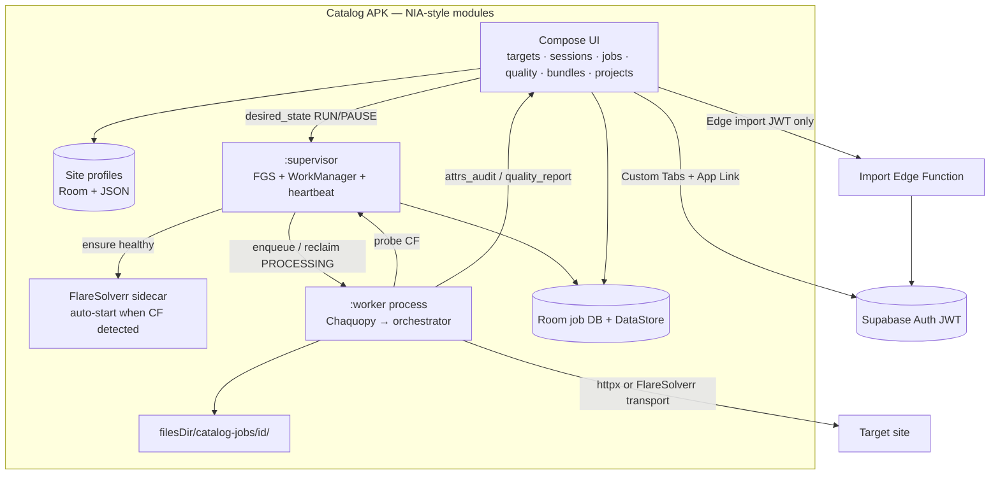

# Megazip Catalog APK (standalone satellite)

- **Status:** Phase 0–3 embedded path implemented in `apps/catalog-apk/` (Chaquopy `:worker`, FlareSolverr lifecycle, JWT Edge import, bundle picker, pause/resume, charge/Wi‑Fi/thermal gates, slot supervisor). LAN FlareSolverr still required for CF targets; on-device companion auto-start is best-effort only.
- **Date:** 2026-08-14
- **Lane(s):** new `@catalog_apk_agent` (greenfield; future home `apps/catalog-apk/` **or** separate repo) · `@data_pipeline_agent` owns shared Python (`data_pipeline.megazip*`, PartSouq + FlareSolverr adapters) · **no** `@hardware_mobile_agent` (no QR/printer/GPS)
- **Skills:** `/token-discipline`; `/parts-catalog-ingestion` when touching publish gates / import filters / CF crawl
- **Guide (pipeline SoT):** [`docs/guides/megazip-multivehicle-catalog.md`](../guides/megazip-multivehicle-catalog.md) · PartSouq + FlareSolverr: [`docs/guides/partsouq-multimake-catalog-pipeline.md`](../guides/partsouq-multimake-catalog-pipeline.md) · VM CF path: [`docs/guides/cloud-multi-make-catalog.md`](../guides/cloud-multi-make-catalog.md)
- **Modules:** `python -m data_pipeline.megazip_catalog_orchestrator` · `python -m data_pipeline.partsouq_catalog_orchestrator`

## Discovery note (Adopt-first)

| Path | Decision |
|------|----------|
| **Integrate** | Fork/adapt [android/nowinandroid](https://github.com/android/nowinandroid) (Apache-2.0) — strip news domain; keep Compose, navigation, settings, WorkManager, FGS patterns |
| **Integrate** | [chaquo/chaquopy](https://github.com/chaquo/chaquopy) (MIT) — embed Python worker on-device |
| **Integrate** | [supabase-community/supabase-kt](https://github.com/supabase-community/supabase-kt) — auth + Storage + Edge invoke |
| **Integrate** | AndroidX WorkManager + FGS `dataSync` (already in NIA); Room + DataStore; AndroidX Browser Custom Tabs |
| **Integrate** | **FlareSolverr** (existing `docker-compose.satellites.yml` profile `scrape` + pipeline `flaresolverr_request`) — Cloudflare clear; do **not** invent a new antibot stack |
| **Build** | Thin adapters only: session → CLI argv, **scrape target profiles** (path templates), quality strip ← `attrs_audit.json` / `quality_report.json`, CF auto-route → FlareSolverr transport, bundle picker → JWT import Edge, supervisor ↔ desired_state |
| **Flag** | Any AGPL/GPL dependency — do not ship without explicit license review |
| **Defer** | worker-kmp / multiplatform workers — optional later |
| **Defer** | Damru/Redroid full Android browser farm — research only if FlareSolverr fails on a target |

**Not invent:** custom job scheduler, custom OAuth WebView, host-PC Python install, service-role keys in the APK, custom Cloudflare solvers (use FlareSolverr).

**Legal/ops:** Operator is responsible for ToS/robots compliance for each selected target. Product is tooling for authorized catalog collection.

---

## Goal

Ship a **standalone Android APK product** (optional satellite — **not** a Nissan GTR Auto ERP storefront module) that:

1. Lets the operator **select a scrape target** (Megazip preset, PartSouq preset, or **custom site profile** with configurable maker/model/variant path templates).
2. Embeds the catalog pipeline as an **on-device worker** for **selected makers / models / chassis**.
3. **Auto-detects Cloudflare** and **bypasses via FlareSolverr** without a manual “enable CF” toggle when the chosen target is blocked.
4. Provides live quality + disk HUD, cooperative pause/resume, supervisor auto-restart, and JWT/Edge import into a chosen Supabase project.

## Non-goals

- Not GTR customer storefront, POS, management, or delivery apps
- Not full multimaker overnight crawl on phone **without** chassis/model selection
- Not requiring a separate PC for every Megazip-only run (CF sidecar only when needed)
- No ZIMRA / FDMS / fiscalisation
- No HTML5 / WebView QR scanning (and no hardware bridges for v1)
- No payroll tax
- Keep-HTML and engine/attrs audit are **not** user product screens (pipeline auto only)
- Not a universal “scrape any site” AI — **profile-driven** adapters with explicit path templates

## Hard exclusions (if code lives in this monorepo)

Same as `.cursorrules` / `AGENTS.md`: no ZIMRA, no payroll tax, Bridge-First for any future hardware, RLS on any new tables, multi-currency awareness on money (import path must not invent USD silently). Catalog APK itself is **operator tooling**, not commerce checkout.

---

## Architecture



```text
APK (Now in Android–style modules)
├── UI Compose (targets, sessions, jobs, quality, bundles, supabase projects)
├── Site profiles (presets + custom path templates)
├── :supervisor FGS + WorkManager + FlareSolverr lifecycle
├── :worker process (Chaquopy → megazip | partsouq | custom adapter)
└── Room job DB + filesDir/catalog-jobs/<id>/
```

**Process boundary:** UI + supervisor share the main app process; Chaquopy worker runs in an isolated `:worker` process so OOM/thermal kill of the interpreter does not wipe Room. Job state and desired_state live in Room; crawl checkpoint lives in pipeline SQLite under the job out-root.

---

## Scrape targets & path configuration (new)

### Site profile model

Each **target** is a versioned JSON profile (shipped presets + user-editable copies):

```json
{
  "id": "megazip",
  "display_name": "Megazip",
  "engine": "megazip",
  "base_url": "https://www.megazip.net",
  "cloudflare": { "mode": "auto", "flaresolverr_url": "http://127.0.0.1:8191/v1" },
  "paths": {
    "parts_hub": "/parts",
    "maker_hub": "/parts/{maker_slug}",
    "catalog_prefix": "/zapchasti-dlya-avtomobilej",
    "model": "/zapchasti-dlya-avtomobilej/{maker_slug}/{model_slug}",
    "variant": "/zapchasti-dlya-avtomobilej/{maker_slug}/{model_slug}/{variant_slug}",
    "section": "/zapchasti-dlya-avtomobilej/{maker_slug}/{model_slug}/{variant_slug}/{section_slug}",
    "maker_slug_map": { "Nissan": "nissan" }
  },
  "selectors": { "preset": "megazip_v1" },
  "rate_limit_seconds": 0.35
}
```

| Field | Purpose |
|-------|---------|
| `engine` | `megazip` \| `partsouq` \| `custom` — which Python orchestrator/adapter |
| `base_url` | Origin the operator selects |
| `paths.*` | **Easy-to-edit** maker/model/variant/section templates when the site differs from Megazip |
| `maker_slug_map` | Display name → URL slug |
| `selectors.preset` | Parser pack (megazip_v1 / partsouq_v1); `custom` later = CSS/xpath pack file |
| `cloudflare.mode` | `auto` (default) \| `always` \| `off` |

**UI:** Target picker → Edit profile (base URL + path fields with live preview of resolved URLs for a sample maker/model) → Save to Room / export JSON. Switching target swaps engine + path pack for new sessions; running jobs keep the profile snapshot they started with.

### Presets (MVP)

| Preset | Engine | CF default |
|--------|--------|------------|
| Megazip | `megazip_catalog_orchestrator` | `auto` (usually direct httpx) |
| PartSouq | `partsouq_catalog_orchestrator` | `auto` → typically FlareSolverr |
| Custom (blank) | `custom` thin adapter wrapping configurable paths + selector pack | `auto` |

Custom MVP: clone Megazip path/selector pack and edit templates; full free-form scrape grammar is Phase 4+.

---

## Cloudflare bypass (automatic)

**Adopt:** existing FlareSolverr integration (`flaresolverr_request`, PartSouq orchestrator health check, `docker-compose.satellites.yml` profile `scrape`).

### Behavior (no manual “bypass CF” product toggle)

1. **Probe** first URL of the session (maker hub) with direct fetch.
2. If response looks like Cloudflare challenge (`cf-` markers, 403 challenge, “Just a moment”, managed challenge title, empty body + CF cookies) **or** profile `cloudflare.mode=always`:
   - Supervisor **ensures FlareSolverr is healthy** at profile URL (default `http://127.0.0.1:8191`).
   - Worker switches transport to FlareSolverr for the job (session reuse / keepalive as in PartSouq).
3. If FlareSolverr is down → supervisor **auto-starts sidecar** when possible; else surface blocking error with one-tap retry (not a settings scavenger hunt).
4. `mode=off` only in **hidden debug** (never default).

### On-device FlareSolverr (S24 Ultra)

| Priority | Mechanism |
|----------|-----------|
| 1 | **Embedded/sidecar** started by supervisor (preferred: local Docker / packaged FlareSolverr service bound to `127.0.0.1:8191`) |
| 2 | **LAN companion** URL in profile (PC/VM already running compose `scrape`) — auto health; same auto-route when CF detected |
| 3 | Fail job with clear “CF detected; FlareSolverr unreachable” |

Do **not** implement browser cookie-stealing Custom Tabs as the primary CF bypass (fragile + ToS-sensitive). FlareSolverr remains SoT.

---

## Product features (automatic where possible)

| # | Feature | Product behavior |
|---|---------|------------------|
| 1 | Chassis-scoped sessions | Maker → model → **chassis multi-select**; session becomes one or more jobs with explicit scope |
| 2 | Live quality strip | Sections / diagrams / publishable / uncategorized / **engine fill** from `attrs_audit.json` + `quality_report.json` (job detail expands samples) |
| 3 | Disk HUD | Free space, `html_dropped` / `html_retained`, disk budget; **charge + Wi‑Fi gates** before crawl |
| 4 | Pause / resume | Cooperative: set `desired_state=PAUSE`; worker finishes current page then checkpoints SQLite; resume continues queue |
| 5 | Supervisor auto-restart | FGS + heartbeat; reclaim `PROCESSING` after stale heartbeat; **Samsung never-sleep onboarding once** |
| 6 | Bundle picker | Import **only** gate-passing chassis/variants; multi-select → chosen Supabase project URL |
| 7 | Supabase auth | Custom Tabs + deep link via supabase-kt; **no service role in APK** — JWT → Edge import |
| 8 | Embedded worker | Zero host setup for Megazip-class runs: Chaquopy + vendored pipeline modules |
| 9 | Keep HTML | **Not a user feature** — pipeline auto-retains weak parses; `--keep-html-cache` debug/operator hidden only |
| 10 | Engine / attrs audit | **Not a manual screen** — auto `attrs_audit.json`; surface in quality strip + job detail |
| 11 | **Scrape target picker** | Select Megazip / PartSouq / Custom; edit **base URL + maker/model/variant path templates** with preview |
| 12 | **Auto Cloudflare bypass** | Detect CF → ensure FlareSolverr → route traffic; no user toggle for normal use |

**Also adopt:** concurrent jobs with **max slots**; `desired_state` RUN/PAUSE; charge-gated crawl; thermal throttle (back off concurrency / delay when `PowerManager` thermal status elevated).

---

## Pipeline defaults the APK must call

Shipped in repo — APK worker argv **must not** opt out unless debug:

| Behavior | Default | Opt-out (hidden / debug) |
|----------|---------|---------------------------|
| Chassis-deep-first queue (Megazip engine) | on | `--no-chassis-deep-first` |
| Parse-and-drop HTML; auto-retain weak parses | on (`--drop-html-after-parse`) | `--keep-html-cache` |
| Chassis prune when deep queue empties; model prune after parse when no PENDING | on (`--prune-html-cache`) | `--no-prune-html-cache` |
| `prepare_remaining_before` for Nissan two-phase | wired in orchestrator | N/A (session scope may use `--single-chassis` / multi chassis jobs) |
| Auto `attrs_audit.json` + quality_report attrs summary | filter phase | — |
| Missing chassis | **blocks** strict import | — |
| Missing engine | **reported**, not blocking | — |
| Engine from Megazip variant attrs | stamped onto variants / fitments / vehicle_master | — |
| Cloudflare | **`auto`** via FlareSolverr when challenged | debug `cloudflare.mode=off` |

PartSouq engine keeps existing FlareSolverr politeness / session reuse from `config/scrape.json` and the multimake guide.

---

## APK session → CLI / engine mapping

Per job: `--out-root` = `filesDir/catalog-jobs/<jobId>/out`.

| Session UI | Behavior |
|------------|----------|
| Target = Megazip | `megazip_catalog_orchestrator` + profile `paths` overlay into `MegazipConfig` / makers file |
| Target = PartSouq | `partsouq_catalog_orchestrator` + FlareSolverr URL from profile; makers from popularity/curated list |
| Target = Custom | Adapter loads path templates + selector preset; CF auto as above |
| Maker pick | `--makers …` / PartSouq maker slug |
| Chassis multi-select `{T31, D23}` | **MVP: one job per chassis** `--single-chassis CODE --no-nissan-two-phase` (Megazip) |
| Smoke / QA | `--max-pages N` (settings debug) |
| Phases crawl→upload | `--phase crawl,parse,transform,pcdb,filter,upload` |
| Import selected bundles | Edge wrapper mirroring `--live-import --complete-only --strict-gate` |
| Streamlining | omit Megazip opt-outs; never expose Keep HTML / CF-off in main UI |

**Out layout under job root** (mirrors guide; engine may use `out/makers/<slug>/` for PartSouq):

```text
filesDir/catalog-jobs/<id>/out/
  profile_snapshot.json    # frozen target paths + CF mode
  manifest.json
  <maker>/
    *.db / cache / bundle /
      quality_report.json
      variant_quality.json
      attrs_audit.json
    diagrams/
```

---

## Self-healing · pause/resume · concurrent slots

```text
desired_state ∈ { RUN, PAUSE }
job.status   ∈ { QUEUED, PROCESSING, PAUSED, COMPLETE, FAILED, CANCELLED }
```

1. **Slots:** `max_concurrent_jobs` (DataStore; default 1 on phone, 2 only if free disk + cool + charging).
2. **Supervisor loop (FGS):** every heartbeat interval — if `desired_state=RUN` and `status=QUEUED|PAUSED` and slot free → start/resume worker; if `desired_state=PAUSE` → signal cooperative stop.
3. **Cooperative pause:** worker checks flag between pages; flushes SQLite; sets `PAUSED`; does not delete out-root.
4. **Reclaim:** `PROCESSING` with heartbeat older than threshold → mark reclaimable → re-enqueue (idempotent; pipeline queue is source of crawl progress).
5. **Charge / Wi‑Fi / thermal:** crawl phase blocked unless charging (or user override in debug) + unmetered Wi‑Fi; thermal elevated → reduce slots to 0 or delay WorkManager.
6. **Samsung onboarding:** one-time sheet — disable battery kill / allow never-sleep for FGS (S24 Ultra checklist below).
7. **FlareSolverr heal:** if CF mode active and health fails mid-job → restart sidecar, requeue `BLOCKED_CF` / ERROR pages (PartSouq pattern), do not wipe crawl DB.

---

## Security

| Rule | Detail |
|------|--------|
| No service role in APK | Import uses user/operator JWT + Edge Function with server-side service role |
| Secrets | Supabase URL + anon key per project in EncryptedSharedPreferences; never log JWT |
| Auth UX | Custom Tabs + App Links / deep link redirect |
| Bundle upload | Prefer Edge accepting job artifact refs or signed upload via user JWT Storage policies |
| FlareSolverr | Bind localhost by default; LAN URL only on trusted network |
| Network | Certificate pinning optional later; TLS only |
| License | Prefer MIT/Apache; flag AGPL |
| Targets | Operator owns legality of scraping each configured site |

---

## Phased delivery

### Phase 0 — Skeleton (NIA fork)

- [ ] Fork/adapt Now in Android; strip news domain; rename app id for catalog satellite
- [ ] Modules: `:app`, `:core:*`, `:feature:targets`, `:feature:sessions`, `:feature:jobs`, `:supervisor`, `:worker`
- [ ] Room entities: SiteProfile, Project, Session, Job, Heartbeat; DataStore settings (slots, gates)
- [ ] Document home: `apps/catalog-apk/` **or** separate repo decision logged

### Phase 1 — Embedded worker MVP (Megazip + target profiles)

- [ ] Chaquopy + vendored megazip modules + configs
- [ ] Ship Megazip + PartSouq **presets**; UI to edit path templates + URL preview
- [ ] Session UI: **target** → maker → chassis multi-select → create jobs
- [ ] Worker invokes correct orchestrator; streamlining defaults for Megazip; out-root under `filesDir`
- [ ] Smoke: **1 chassis**, `--max-pages` bound, quality strip reads `attrs_audit` / `quality_report`
- [ ] Disk HUD + charge + Wi‑Fi gates

### Phase 2 — Supervisor resilience + CF auto

- [ ] FGS `dataSync` + WorkManager; heartbeat; reclaim PROCESSING
- [ ] Pause/resume cooperative; concurrent max slots; thermal throttle
- [ ] Samsung never-sleep onboarding once
- [ ] **CF probe + auto FlareSolverr route**; sidecar auto-start or LAN URL health
- [ ] PartSouq engine end-to-end on device/LAN FlareSolverr

### Phase 3 — Auth + import

- [ ] supabase-kt Custom Tabs auth; multi-project picker (URL + anon key)
- [ ] Bundle picker: list gate-passing variants/chassis from job bundle; multi-select
- [ ] Edge import path (JWT); no service role in APK; strict gate respected (missing chassis blocks)

### Phase 4 — Polish + custom adapters

- [ ] Live quality strip polish; job detail samples from attrs_audit
- [ ] Custom selector packs beyond path templates (CSS/xpath) as needed
- [ ] Hidden debug: `--keep-html-cache`, `--no-chassis-deep-first`, `cloudflare.mode=off`, `--max-pages`
- [ ] Ops checklist in-app (S24 Ultra); crash/ANR hardening; license NOTICE
- [ ] Optional: Damru evaluation only if FlareSolverr insufficient

---

## Samsung S24 Ultra ops checklist

- [ ] Charging while crawling (gate default on)
- [ ] Unmetered Wi‑Fi only for crawl
- [ ] Disable battery optimization / allow unrestricted for app
- [ ] Complete one-time “never sleep / don’t kill FGS” onboarding
- [ ] Confirm free disk ≥ budget (HUD); abort before crawl if below floor
- [ ] Prefer cool device; expect thermal throttle to pause slots
- [ ] Do not run multimaker unbounded; chassis-scoped sessions only
- [ ] If target is CF-protected: confirm FlareSolverr sidecar running (auto) or LAN URL reachable

---

## Test plan

| Layer | Coverage |
|-------|----------|
| Pipeline (already) | Megazip: deep-first, parse-and-drop, prune, attrs_audit; PartSouq: FlareSolverr health / requeue patterns |
| APK unit | Profile path resolution; session→argv/engine mapping; CF detector fixtures; desired_state; slot allocator; quality JSON parsers |
| APK instrumented | WorkManager pause/resume; FGS reclaim; FlareSolverr health fail→restart; Custom Tabs auth |
| Smoke E2E | Megazip 1 chassis no CF; PartSouq (or CF fixture) forces FlareSolverr path; import JWT dry-run |

---

## Open questions / decisions log

| ID | Question | Decision / default |
|----|----------|--------------------|
| Q1 | Monorepo `apps/catalog-apk/` vs separate repo? | **Open** — plan assumes either; start scaffold when Phase 0 begins |
| Q2 | One job per chassis vs one job multi-chassis? | **MVP: one job per chassis** (`--single-chassis`) |
| Q3 | Edge Function name / contract? | **Open** — must accept JWT + bundle payload/refs; mirror CLI `--live-import --complete-only --strict-gate` |
| Q4 | Non-Nissan makers on phone MVP? | **Defer** after Nissan Megazip chassis smoke; PartSouq makers follow with CF path |
| Q5 | `@catalog_apk_agent` in `rufler.yaml`? | **Add when scaffold starts** |
| Q6 | Chaquopy Python version / ABI set? | Pin at Phase 1; arm64-v8a primary (S24 Ultra) |
| Q7 | How is FlareSolverr packaged on-device? | **Phase 2 spike:** Docker-on-Android vs bundled service vs LAN-only; pick one before PartSouq MVP |
| Q8 | Custom engine beyond path overlays? | **MVP:** path templates + existing parser presets; free-form selectors in Phase 4 |

---

## Success criteria

1. Operator selects a **scrape target**, edits maker/model paths if needed, picks chassis, starts job(s) with **zero host Python setup** (FlareSolverr only when CF requires it).
2. Worker runs the correct engine with **streamlining defaults** (Megazip) and frozen `profile_snapshot.json`.
3. **CF-blocked targets auto-route through FlareSolverr** without a primary UI toggle.
4. Quality strip shows live sections/diagrams/publishable/uncategorized/**engine fill** — no manual audit UI.
5. Pause/resume and process death recover via Room + SQLite checkpoint + supervisor reclaim.
6. Import only gate-passing variants into chosen Supabase project via **JWT/Edge** — **no service role in APK**.
7. Keep HTML and attrs audit remain automatic; `--keep-html-cache` / CF-off remain debug-only.
8. Hard exclusions respected; product documented as **optional satellite**, not GTR storefront.

---

## Handoff

1. `/manager` sequences Phase 0+ when build starts; register `@catalog_apk_agent` path in `rufler.yaml` if monorepo
2. `@data_pipeline_agent` — profile overlay into MegazipConfig; shared CF probe helper; PartSouq FlareSolverr URL from profile; any multi-chassis argv gaps
3. `@catalog_apk_agent` — implement Phases 0→4; **do not** touch `apps/web`
4. `/security-reviewer` before shipping auth/import/CF sidecar (localhost bind, no service role)
5. `/verifier` — exclusions + Megazip 1-chassis smoke + CF fixture path; pipeline tests remain green
6. `/parts-catalog-ingestion` when changing publish/import/CF crawl gates
